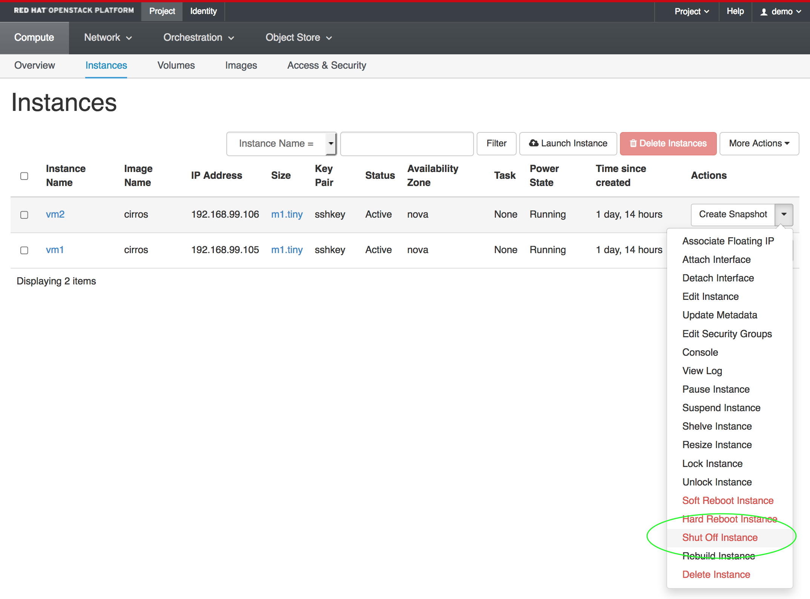
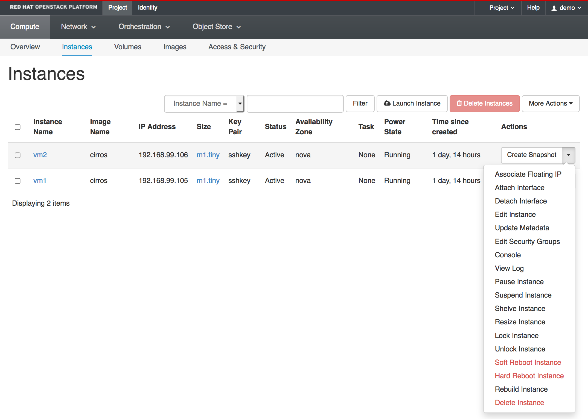
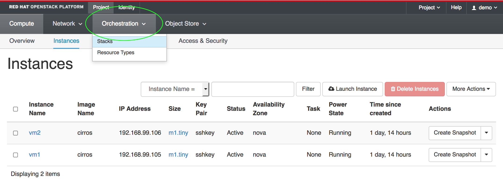
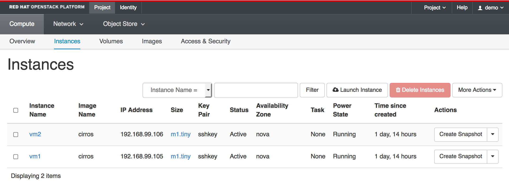

# お題: Horizonのカスタマイズ

- バージョン
  - RHEL OSP9 (Mitaka)
  - RHEL7.3

## 起動

httpd起動時、Djangoの仕組みでcollectstatic, compressをしている。

```
# systemctl cat httpd
# /usr/lib/systemd/system/httpd.service
[Unit]
Description=The Apache HTTP Server
After=network.target remote-fs.target nss-lookup.target
Documentation=man:httpd(8)
Documentation=man:apachectl(8)

[Service]
Type=notify
EnvironmentFile=/etc/sysconfig/httpd
ExecStart=/usr/sbin/httpd $OPTIONS -DFOREGROUND
ExecReload=/usr/sbin/httpd $OPTIONS -k graceful
ExecStop=/bin/kill -WINCH ${MAINPID}
# We want systemd to give httpd some time to finish gracefully, but still want
# it to kill httpd after TimeoutStopSec if something went wrong during the
# graceful stop. Normally, Systemd sends SIGTERM signal right after the
# ExecStop, which would kill httpd. We are sending useless SIGCONT here to give
# httpd time to finish.
KillSignal=SIGCONT
PrivateTmp=true

[Install]
WantedBy=multi-user.target

# /usr/lib/systemd/system/httpd.service.d/openstack-dashboard.conf
[Service]
ExecStartPre=/usr/bin/python /usr/share/openstack-dashboard/manage.py collectstatic --noinput --clear
ExecStartPre=/usr/bin/python /usr/share/openstack-dashboard/manage.py compress --force
TimeoutStartSec=2min

[Unit]
After=memcached.service

#
```

collectstaticはstaticなファイル(js, css, html等)を一箇所 (STATIC_ROOT) に集める。
Djangoプロジェクトの中で、複数アプリが動いているとき、静的ファイルを扱うnginx等が一箇所だけ見ればいいようにするため。

RDO/RHOSPの場合、STATIC_ROOTは/usr/share/openstack-dashboard/staticになる。
Horizonをカスタマイズする場合、この下のファイルは触らなくてもいい ("systemctl restart httpd" すると上書きされる)。

## 見た目のカスタマイズ

ROOT\_PATH = /usr/share/openstack-dashboard

害のない (Horizonのコードを改変しない) カスタマイズは2箇所。

- policy.json
- ROOT\_PATH/openstack_dashboard/enabled

### policy.json

HorizonからのAPIコールの認可設定。

※ 通常のAPIコール (CLI等) の認可設定は /etc/プロジェクト名/policy.json (例:/etc/nova/policy.json) で行う。

設定ファイル: /etc/openstack-dashboard/*_policy.json

```
# ls -1 /etc/openstack-dashboard/*_policy.json
/etc/openstack-dashboard/ceilometer_policy.json
/etc/openstack-dashboard/cinder_policy.json
/etc/openstack-dashboard/glance_policy.json
/etc/openstack-dashboard/heat_policy.json
/etc/openstack-dashboard/keystone_policy.json
/etc/openstack-dashboard/neutron_policy.json
/etc/openstack-dashboard/nova_policy.json
#
```

編集後のhttpd再起動は必要なし。ブラウザリロードで反映。

```
# diff -u nova_policy.json.orig nova_policy.json
--- nova_policy.json.orig       2016-11-16 14:48:59.264037839 +0900
+++ nova_policy.json    2016-11-16 14:51:43.669205441 +0900
@@ -26,7 +26,7 @@
     "compute:get_instance_diagnostics": "",

     "compute:start": "rule:admin_or_owner",
-    "compute:stop": "rule:admin_or_owner",
+    "compute:stop": "is_adimn:True",

     "compute:get_lock": "",
     "compute:lock": "",
#
```

- 変更前



- 変更後



### ROOT\_PATH/openstack_dashboard/enabled

/usr/share/openstack-dashboard/openstack_dashboard/enabledのファイルでパネルごとの表示・非表示等をカスタマイズする。

例として、Heatのパネルグループ ("Orchestration"タブ) を消す。

1. "Orchestration"→"Stacks"のパネル

  "Orchestration"→"Stacks"のパネルは、\_1620\_project\_stacks\_panel.pyで定義されている。
  このファイルを\_99\_disable\_project\_resource\_types\_panel.pyという名前でコピーし、末尾に"REMOVE_PANEL = True"を追記する。

  ```
  [root@osp7ps-controller01 enabled]# diff -u _1620_project_stacks_panel.py _99_disable_project_stacks_panel.py
  --- _1620_project_stacks_panel.py       2016-06-03 05:05:51.000000000 +0900
  +++ _99_disable_project_stacks_panel.py 2016-11-16 12:20:16.166270202 +0900
  @@ -7,3 +7,5 @@

   # Python panel class of the PANEL to be added.
   ADD_PANEL = 'openstack_dashboard.dashboards.project.stacks.panel.Stacks'
  +
  +REMOVE_PANEL = True
  [root@osp7ps-controller01 enabled]#
  ```

2. "Orchestration"→"Resource Types"のパネル

  "Orchestration"→"Resource Types"のパネルは、\_1630\_project\_resource\_types\_panel.pyで定義されている。
  このファイルを\_99\_disable\_project\_resource\_types\_panel.pyという名前でコピーし、末尾に"REMOVE_PANEL = True"を追記する。

  ```
  [root@osp7ps-controller01 enabled]# diff -u _1630_project_resource_types_panel.py _99_disable_project_resource_types_panel.py
  --- _1630_project_resource_types_panel.py       2016-06-03 05:05:51.000000000 +0900
  +++ _99_disable_project_resource_types_panel.py 2016-11-16 12:22:00.015642964 +0900
  @@ -8,3 +8,5 @@
   # Python panel class of the PANEL to be added.
   ADD_PANEL = ('openstack_dashboard.dashboards.project.'
                'stacks.resource_types.panel.ResourceTypes')
  +
  +REMOVE_PANEL = True
  [root@osp7ps-controller01 enabled]#
  ```

3. サービス再起動

httpdを再起動すると反映される。

- 変更前



- 変更後



