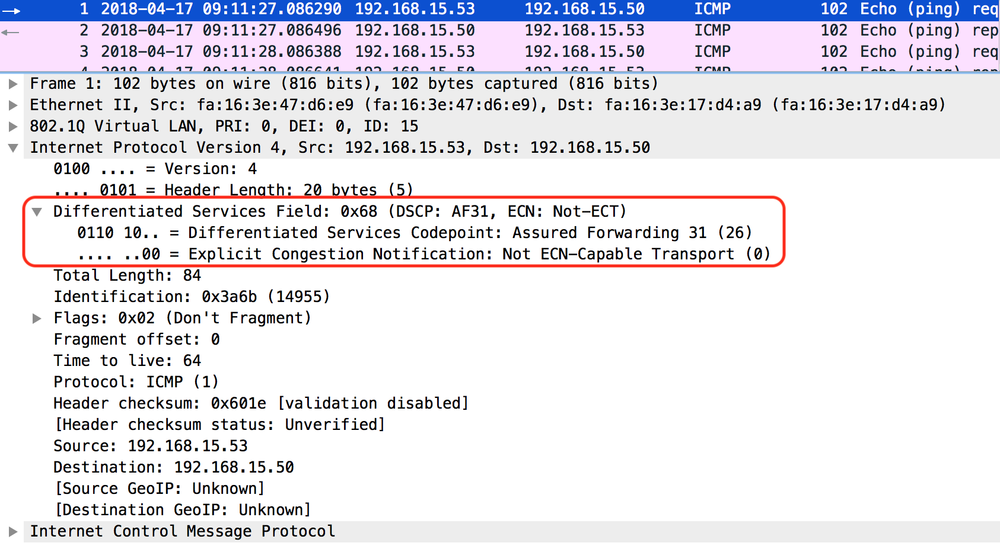

# QoS implementation - Nova vs Neutron vs Cinder

## Summary

| Component | QoS Resource | Implementation |
|:---------|:---------|:---------------|
| Nova | CPU | nova => cgroups |
| Nova | Disk | nova => libvirt => qemu throttle |
| Nova | Network | nova => libvirt => tc |
| Neutron | Bandwidth | neutron => ovsdb => ovs => tc |
| Neutron | DSCP marking | neutron => ovs => flow entry |
| Cinder | Disk (consumer='front-end') | cinder => nova => libvirt => qemu throttle |
| Cinder | Disk (consumer='back-end') | cinder => cinder driver (backend specific qos) |

# Preparation

## Flavor

### m1.normal : a flavor without QoS properties

Create a flavor without QoS properties.

```
openstack flavor create --ram 1024 --disk 20 --vcpus 1 m1.normal
```

```
[stack@director ~]$ openstack flavor show m1.normal
+----------------------------+--------------------------------------------+
| Field                      | Value                                      |
+----------------------------+--------------------------------------------+
| OS-FLV-DISABLED:disabled   | False                                      |
| OS-FLV-EXT-DATA:ephemeral  | 0                                          |
| access_project_ids         | None                                       |
| disk                       | 20                                         |
| id                         | ed846e28-510c-4ca8-8bd9-0e06f5de6461       |
| name                       | m1.normal                                  |
| os-flavor-access:is_public | True                                       |
| properties                 | aggregate_instance_extra_specs:host='vlan' |
| ram                        | 1024                                       |
| rxtx_factor                | 1.0                                        |
| swap                       |                                            |
| vcpus                      | 1                                          |
+----------------------------+--------------------------------------------+
```

### m1.resquota : a flavor with QoS properties

Create a flavor with QoS properties.

```
openstack flavor create --ram 1024 --disk 20 --vcpus 1 m1.resquota
```

```
openstack flavor set m1.resquota \
--property quota:cpu_shares=512 \
--property quota:disk_read_bytes_sec=1000000 \
--property quota:disk_write_bytes_sec=1024000 \
--property quota:vif_outbound_average=32768 \
--property quota:vif_outbound_peak=65536 \
--property quota:vif_outbound_burst=131072 \
--property quota:vif_inbound_average=32768 \
--property quota:vif_inbound_peak=65536 \
--property quota:vif_inbound_burst=131072
```

```
[stack@director scripts]$ openstack flavor show m1.resquota
+----------------------------+----------------------------------------------------------------------------------------------------------------------------------------------------------------------------------------------------------------------------------------------------------------------------------------------------------------+
| Field                      | Value                                                                                                                                                                                                                                                                                                          |
+----------------------------+----------------------------------------------------------------------------------------------------------------------------------------------------------------------------------------------------------------------------------------------------------------------------------------------------------------+
| OS-FLV-DISABLED:disabled   | False                                                                                                                                                                                                                                                                                                          |
| OS-FLV-EXT-DATA:ephemeral  | 0                                                                                                                                                                                                                                                                                                              |
| access_project_ids         | None                                                                                                                                                                                                                                                                                                           |
| disk                       | 20                                                                                                                                                                                                                                                                                                             |
| id                         | bb3c4ff8-c09f-444d-955e-46e4e1f6fb4a                                                                                                                                                                                                                                                                           |
| name                       | m1.resquota                                                                                                                                                                                                                                                                                                    |
| os-flavor-access:is_public | True                                                                                                                                                                                                                                                                                                           |
| properties                 | quota:cpu_shares='512', quota:disk_read_bytes_sec='1000000', quota:disk_write_bytes_sec='1024000', quota:vif_inbound_average='32768', quota:vif_inbound_burst='131072', quota:vif_inbound_peak='65536', quota:vif_outbound_average='32768', quota:vif_outbound_burst='131072', quota:vif_outbound_peak='65536' |
| ram                        | 1024                                                                                                                                                                                                                                                                                                           |
| rxtx_factor                | 1.0                                                                                                                                                                                                                                                                                                            |
| swap                       |                                                                                                                                                                                                                                                                                                                |
| vcpus                      | 1                                                                                                                                                                                                                                                                                                              |
+----------------------------+----------------------------------------------------------------------------------------------------------------------------------------------------------------------------------------------------------------------------------------------------------------------------------------------------------------+
```

## Instance

### Create an insntance without QoS properties

```
[stack@director ~]$ openstack server create --wait --flavor m1.normal  --key-name sshkey_test --image rhel7 --security-group sg_test --network mplane_vlan11 --network provider_test15 --network provider_test16 --availability-zone az_vlan vm_normal

+-----------------------------+----------------------------------------------------------------------------------------+
| Field                       | Value                                                                                  |
+-----------------------------+----------------------------------------------------------------------------------------+
| OS-DCF:diskConfig           | MANUAL                                                                                 |
| OS-EXT-AZ:availability_zone | az_vlan                                                                                |
| OS-EXT-STS:power_state      | Running                                                                                |
| OS-EXT-STS:task_state       | None                                                                                   |
| OS-EXT-STS:vm_state         | active                                                                                 |
| OS-SRV-USG:launched_at      | 2018-04-16T12:50:22.000000                                                             |
| OS-SRV-USG:terminated_at    | None                                                                                   |
| accessIPv4                  |                                                                                        |
| accessIPv6                  |                                                                                        |
| addresses                   | mplane_vlan11=10.11.0.57; provider_test16=192.168.16.55; provider_test15=192.168.15.58 |
| adminPass                   | BG79PRhis4FP                                                                           |
| config_drive                |                                                                                        |
| created                     | 2018-04-16T12:50:10Z                                                                   |
| flavor                      | m1.normal (ed846e28-510c-4ca8-8bd9-0e06f5de6461)                                       |
| hostId                      | 708fc4d3217216cfed661ae2aaf627fec49f12437d221cf1fd1faed9                               |
| id                          | 30ad89ac-5906-49ca-8d52-3c6343c598f6                                                   |
| image                       | rhel7 (c11a1c31-f703-4ae6-a689-5a6b9a624625)                                           |
| key_name                    | sshkey_test                                                                            |
| name                        | vm_normal                                                                              |
| progress                    | 0                                                                                      |
| project_id                  | 995b4947cc4044fba99bade057053803                                                       |
| properties                  |                                                                                        |
| security_groups             | name='sg_test'                                                                         |
|                             | name='sg_test'                                                                         |
|                             | name='sg_test'                                                                         |
| status                      | ACTIVE                                                                                 |
| updated                     | 2018-04-16T12:50:22Z                                                                   |
| user_id                     | 5a86b1db33b64571953b2022186010fe                                                       |
| volumes_attached            |                                                                                        |
+-----------------------------+----------------------------------------------------------------------------------------+
```

### Create an instance with QoS properties

```
[stack@director ~]$ openstack server create --wait --flavor m1.resquota  --key-name sshkey_test --image rhel7 --security-group sg_test --network mplane_vlan11 --network provider_test15 --network provider_test16 --availability-zone az_vlan vm_resquota

+-----------------------------+----------------------------------------------------------------------------------------+
| Field                       | Value                                                                                  |
+-----------------------------+----------------------------------------------------------------------------------------+
| OS-DCF:diskConfig           | MANUAL                                                                                 |
| OS-EXT-AZ:availability_zone | az_vlan                                                                                |
| OS-EXT-STS:power_state      | Running                                                                                |
| OS-EXT-STS:task_state       | None                                                                                   |
| OS-EXT-STS:vm_state         | active                                                                                 |
| OS-SRV-USG:launched_at      | 2018-04-16T12:48:48.000000                                                             |
| OS-SRV-USG:terminated_at    | None                                                                                   |
| accessIPv4                  |                                                                                        |
| accessIPv6                  |                                                                                        |
| addresses                   | mplane_vlan11=10.11.0.51; provider_test16=192.168.16.51; provider_test15=192.168.15.57 |
| adminPass                   | ZS6k7mACH3qt                                                                           |
| config_drive                |                                                                                        |
| created                     | 2018-04-16T12:48:32Z                                                                   |
| flavor                      | m1.resquota (bb3c4ff8-c09f-444d-955e-46e4e1f6fb4a)                                     |
| hostId                      | 708fc4d3217216cfed661ae2aaf627fec49f12437d221cf1fd1faed9                               |
| id                          | 850724a4-029c-457b-a99d-3a18e8e413da                                                   |
| image                       | rhel7 (c11a1c31-f703-4ae6-a689-5a6b9a624625)                                           |
| key_name                    | sshkey_test                                                                            |
| name                        | vm_resquota                                                                            |
| progress                    | 0                                                                                      |
| project_id                  | 995b4947cc4044fba99bade057053803                                                       |
| properties                  |                                                                                        |
| security_groups             | name='sg_test'                                                                         |
|                             | name='sg_test'                                                                         |
|                             | name='sg_test'                                                                         |
| status                      | ACTIVE                                                                                 |
| updated                     | 2018-04-16T12:48:48Z                                                                   |
| user_id                     | 5a86b1db33b64571953b2022186010fe                                                       |
| volumes_attached            |                                                                                        |
+-----------------------------+----------------------------------------------------------------------------------------+
```

```
[stack@director ~]$ openstack server create --wait --flavor m1.normal  --key-name sshkey_test --image rhel7 --security-group sg_test --network mplane_vlan11 --network provider_test15 --network provider_test16 --availability-zone az_vlan vm_neutron_qos

+-----------------------------+----------------------------------------------------------------------------------------+
| Field                       | Value                                                                                  |
+-----------------------------+----------------------------------------------------------------------------------------+
| OS-DCF:diskConfig           | MANUAL                                                                                 |
| OS-EXT-AZ:availability_zone | az_vlan                                                                                |
| OS-EXT-STS:power_state      | Running                                                                                |
| OS-EXT-STS:task_state       | None                                                                                   |
| OS-EXT-STS:vm_state         | active                                                                                 |
| OS-SRV-USG:launched_at      | 2018-04-16T13:21:24.000000                                                             |
| OS-SRV-USG:terminated_at    | None                                                                                   |
| accessIPv4                  |                                                                                        |
| accessIPv6                  |                                                                                        |
| addresses                   | mplane_vlan11=10.11.0.53; provider_test16=192.168.16.53; provider_test15=192.168.15.53 |
| adminPass                   | U8NbAriWSbwU                                                                           |
| config_drive                |                                                                                        |
| created                     | 2018-04-16T13:21:11Z                                                                   |
| flavor                      | m1.normal (ed846e28-510c-4ca8-8bd9-0e06f5de6461)                                       |
| hostId                      | 708fc4d3217216cfed661ae2aaf627fec49f12437d221cf1fd1faed9                               |
| id                          | 9e6c9377-ff30-4aa8-9220-2e663dfd54b7                                                   |
| image                       | rhel7 (c11a1c31-f703-4ae6-a689-5a6b9a624625)                                           |
| key_name                    | sshkey_test                                                                            |
| name                        | vm_neutron_qos                                                                         |
| progress                    | 0                                                                                      |
| project_id                  | 995b4947cc4044fba99bade057053803                                                       |
| properties                  |                                                                                        |
| security_groups             | name='sg_test'                                                                         |
|                             | name='sg_test'                                                                         |
|                             | name='sg_test'                                                                         |
| status                      | ACTIVE                                                                                 |
| updated                     | 2018-04-16T13:21:24Z                                                                   |
| user_id                     | 5a86b1db33b64571953b2022186010fe                                                       |
| volumes_attached            |                                                                                        |
+-----------------------------+----------------------------------------------------------------------------------------+
```

# Nova QoS

## CPU QoS

### Without QoS

libvit XML:

```xml
  <cputune>
    <shares>1024</shares>
  </cputune>
```

Resulted cgroups setting:

```
[root@comp-1 ~]# cat /sys/fs/cgroup/cpu/machine.slice/machine-qemu\\x2d11\\x2dinstance\\x2d00000042.scope/cpu.shares
1024
```

### With QoS

libvit XML: "quota:cpu_shares=512"

```xml
  <cputune>
    <shares>512</shares>
  </cputune>
```

Resulted cgroups setting:

```
[root@comp-1 ~]# cat /sys/fs/cgroup/cpu/machine.slice/machine-qemu\\x2d10\\x2dinstance\\x2d00000041.scope/cpu.shares
512
```

### Code Reading

<details>
<summary>
Nova side
</summary>
<div>

- LibvirtDriver.\_update\_guest\_cputune() @nova/virt/libvirt/driver.py

```python
class LibvirtDriver(driver.ComputeDriver):
<snip>
    def _update_guest_cputune(self, guest, flavor, virt_type):
<snip>
        cputuning = ['shares', 'period', 'quota']
<snip>
        if guest.cputune is None:
            guest.cputune = vconfig.LibvirtConfigGuestCPUTune()
            # Setting the default cpu.shares value to be a value
            # dependent on the number of vcpus
        guest.cputune.shares = 1024 * guest.vcpus

        for name in cputuning:
            key = "quota:cpu_" + name
            if key in flavor.extra_specs:
                setattr(guest.cputune, name,
                        int(flavor.extra_specs[key]))
```

- class LibvirtConfigGuestCPUTune @nova/virt/libvirt/config.py

```python
class LibvirtConfigGuestCPUTune(LibvirtConfigObject):

    def __init__(self, **kwargs):
        super(LibvirtConfigGuestCPUTune, self).__init__(root_name="cputune",
                                                        **kwargs)
<snip>

    def format_dom(self):
        root = super(LibvirtConfigGuestCPUTune, self).format_dom()

        if self.shares is not None:
            root.append(self._text_node("shares", str(self.shares)))
<snip>
```

</div>
</details>

<details>
<summary>
Libvirt side
</summary>
<div>

parsing

- struct _virHypervisorDriver qemuHypervisorDriver @src/qemu/qemu\_driver.c

```c
static virHypervisorDriver qemuHypervisorDriver = {
<snip>
    .domainSetSchedulerParameters = qemuDomainSetSchedulerParameters, /* 0.7.0 */
    .domainSetSchedulerParametersFlags = qemuDomainSetSchedulerParametersFlags, /* 0.9.2 */
<snip>
}
```

```c
static int
qemuDomainSetSchedulerParameters(virDomainPtr dom,
                                 virTypedParameterPtr params,
                                 int nparams)
{
    return qemuDomainSetSchedulerParametersFlags(dom,
                                                 params,
                                                 nparams,
                                                 VIR_DOMAIN_AFFECT_CURRENT);
}
```

```c
static int
qemuDomainSetSchedulerParametersFlags(virDomainPtr dom,
                                      virTypedParameterPtr params,
                                      int nparams,
                                      unsigned int flags)
{
<snip>
    for (i = 0; i < nparams; i++) {
        virTypedParameterPtr param = &params[i];
        value_ul = param->value.ul;
        value_l = param->value.l;

        if (STREQ(param->field, VIR_DOMAIN_SCHEDULER_CPU_SHARES)) {
            if (def) {
                unsigned long long val;
                if (virCgroupSetCpuShares(priv->cgroup, value_ul) < 0)
                    goto endjob;

                if (virCgroupGetCpuShares(priv->cgroup, &val) < 0)
                    goto endjob;

                def->cputune.shares = val;
                def->cputune.sharesSpecified = true;

                if (virTypedParamsAddULLong(&eventParams, &eventNparams,
                                            &eventMaxNparams,
                                            VIR_DOMAIN_TUNABLE_CPU_CPU_SHARES,
                                            val) < 0)
                    goto endjob;
            }

            if (persistentDef) {
                persistentDefCopy->cputune.shares = value_ul;
                persistentDefCopy->cputune.sharesSpecified = true;
            }
<snip>
}
```

```c
int
virCgroupSetCpuShares(virCgroupPtr group, unsigned long long shares)
{
    return virCgroupSetValueU64(group,
                                VIR_CGROUP_CONTROLLER_CPU,
                                "cpu.shares", shares);
}
```

lauching qemu

- qemuProcessLaunch() @src/qemu/qemu\_process.c
=> qemuSetupCgroup() @src/qemu/qemu\_cgroup.c
=> qemuSetupCpuCgroup() @src/qemu/qemu\_cgroup.c

- qemuSetupCpuCgroup() @src/qemu/qemu\_cgroup.c

```c
static int
qemuSetupCpuCgroup(virQEMUDriverPtr driver,
                   virDomainObjPtr vm)
{
<snip>
    if (vm->def->cputune.sharesSpecified) {
        unsigned long long val;
        if (virCgroupSetCpuShares(priv->cgroup, vm->def->cputune.shares) < 0)
            return -1;

        if (virCgroupGetCpuShares(priv->cgroup, &val) < 0)
            return -1;
        if (vm->def->cputune.shares != val) {
            vm->def->cputune.shares = val;
            if (virTypedParamsAddULLong(&eventParams, &eventNparams,
                                        &eventMaxparams,
                                        VIR_DOMAIN_TUNABLE_CPU_CPU_SHARES,
                                        val) < 0)
                return -1;

            event = virDomainEventTunableNewFromObj(vm, eventParams, eventNparams);
        }

        qemuDomainEventQueue(driver, event);
    }

    return 0;
}
```

</div>
</details>

## Disk I/O QoS

### Without QoS

libvirt XML:

```xml
    <disk type='file' device='disk'>
      <driver name='qemu' type='qcow2' cache='none'/>
      <source file='/var/lib/nova/instances/30ad89ac-5906-49ca-8d52-3c6343c598f6/disk'/>
      <backingStore type='file' index='1'>
        <format type='raw'/>
        <source file='/var/lib/nova/instances/_base/a24c93285792d6ac5a718a70a6ef23e119f98f54'/>
        <backingStore/>
      </backingStore>
      <target dev='vda' bus='virtio'/>
      <alias name='virtio-disk0'/>
      <address type='pci' domain='0x0000' bus='0x00' slot='0x06' function='0x0'/>
    </disk>
```

Qemu options:

```
-drive file=/var/lib/nova/instances/30ad89ac-5906-49ca-8d52-3c6343c598f6/disk,format=qcow2,if=none,id=drive-virtio-disk0,cache=none
```


### With QoS

libvit XML: with "quota:disk\_read\_bytes\_sec=1000000" and "quota:disk\_write\_bytes\_sec=1024000" flavor properties, disk related XML gets \<iotune\> element.

```xml
    <disk type='file' device='disk'>
      <driver name='qemu' type='qcow2' cache='none'/>
      <source file='/var/lib/nova/instances/850724a4-029c-457b-a99d-3a18e8e413da/disk'/>
      <backingStore type='file' index='1'>
        <format type='raw'/>
        <source file='/var/lib/nova/instances/_base/a24c93285792d6ac5a718a70a6ef23e119f98f54'/>
        <backingStore/>
      </backingStore>
      <target dev='vda' bus='virtio'/>
      <iotune>
        <read_bytes_sec>1000000</read_bytes_sec>
        <write_bytes_sec>1024000</write_bytes_sec>
      </iotune>
      <alias name='virtio-disk0'/>
      <address type='pci' domain='0x0000' bus='0x00' slot='0x06' function='0x0'/>
    </disk>
```

Qemu options: \<iotune\> elements are translated into throttling.bps-read and throttling.bps-write Qemu options.

```
-drive file=/var/lib/nova/instances/850724a4-029c-457b-a99d-3a18e8e413da/disk,format=qcow2,if=none,id=drive-virtio-disk0,cache=none,throttling.bps-read=1000000,throttling.bps-write=1024000
```

See also: [I/O scheduling, iotune and difference between read_bytes_sec and read_bytes_sec_max in qemu/kvm](https://access.redhat.com/solutions/3153531)

### Code Reading

<details>
<summary>
Nova side
</summary>
<div>

\<iotune\> element is generated from LibvirtConfigGuestDisk.

- LibvirtConfigGuestDisk.format\_dom() @nova/virt/libvirt/config.py

```python
class LibvirtConfigGuestDisk(LibvirtConfigGuestDevice):
<snip>
    def format_dom(self):
        iotune = etree.Element("iotune")

        if self.disk_read_bytes_sec is not None:
            iotune.append(self._text_node("read_bytes_sec",
                self.disk_read_bytes_sec))

        if self.disk_read_iops_sec is not None:
            iotune.append(self._text_node("read_iops_sec",
                self.disk_read_iops_sec))

        if self.disk_write_bytes_sec is not None:
            iotune.append(self._text_node("write_bytes_sec",
                self.disk_write_bytes_sec))

        if self.disk_write_iops_sec is not None:
            iotune.append(self._text_node("write_iops_sec",
                self.disk_write_iops_sec))

        if self.disk_total_bytes_sec is not None:
            iotune.append(self._text_node("total_bytes_sec",
                self.disk_total_bytes_sec))

        if self.disk_total_iops_sec is not None:
            iotune.append(self._text_node("total_iops_sec",
                self.disk_total_iops_sec))

        if len(iotune) > 0:
            dev.append(iotune)
```

</div>
</details>

<details>
<summary>
Libvirt side
</summary>
<div>

- qemuBuildDriveStr() @libvirt-3.2.0/src/qemu/qemu_command.c

```c
char *
qemuBuildDriveStr(virDomainDiskDefPtr disk,
                  virQEMUDriverConfigPtr cfg,
                  bool bootable,
                  virQEMUCapsPtr qemuCaps)
{
<snip>
    if (qemuCheckDiskConfigBlkdeviotune(disk, qemuCaps) < 0)
        goto error;

#define IOTUNE_ADD(_field, _label)                                             \
    if (disk->blkdeviotune._field) {                                           \
        virBufferAsprintf(&opt, ",throttling." _label "=%llu",                 \
                           disk->blkdeviotune._field);                         \
    }

    IOTUNE_ADD(total_bytes_sec, "bps-total");
    IOTUNE_ADD(read_bytes_sec, "bps-read");
    IOTUNE_ADD(write_bytes_sec, "bps-write");
    IOTUNE_ADD(total_iops_sec, "iops-total");
    IOTUNE_ADD(read_iops_sec, "iops-read");
    IOTUNE_ADD(write_iops_sec, "iops-write");

    IOTUNE_ADD(total_bytes_sec_max, "bps-total-max");
    IOTUNE_ADD(read_bytes_sec_max, "bps-read-max");
    IOTUNE_ADD(write_bytes_sec_max, "bps-write-max");
    IOTUNE_ADD(total_iops_sec_max, "iops-total-max");
    IOTUNE_ADD(read_iops_sec_max, "iops-read-max");
    IOTUNE_ADD(write_iops_sec_max, "iops-write-max");

    IOTUNE_ADD(size_iops_sec, "iops-size");
    if (disk->blkdeviotune.group_name) {
        virBufferEscapeString(&opt, ",throttling.group=%s",
                              disk->blkdeviotune.group_name);
    }

    IOTUNE_ADD(total_bytes_sec_max_length, "bps-total-max-length");
    IOTUNE_ADD(read_bytes_sec_max_length, "bps-read-max-length");
    IOTUNE_ADD(write_bytes_sec_max_length, "bps-write-max-length");
    IOTUNE_ADD(total_iops_sec_max_length, "iops-total-max-length");
    IOTUNE_ADD(read_iops_sec_max_length, "iops-read-max-length");
    IOTUNE_ADD(write_iops_sec_max_length, "iops-write-max-length");

#undef IOTUNE_ADD
<snip>
}
```

</div>
</details>

## Network QoS

### Without QoS

#### libvirt XML

```xml
    <interface type='bridge'>
      <mac address='fa:16:3e:be:fd:48'/>
      <source bridge='br-int'/>
      <virtualport type='openvswitch'>
        <parameters interfaceid='b614c1d3-75e5-483f-88fd-cec050652945'/>
      </virtualport>
      <target dev='tapb614c1d3-75'/>
      <model type='virtio'/>
      <alias name='net0'/>
      <address type='pci' domain='0x0000' bus='0x00' slot='0x03' function='0x0'/>
    </interface>
```

#### tc outputs

##### qdisc

```
[root@comp-1 ~]# tc qdisc show dev tapb614c1d3-75
qdisc pfifo_fast 0: root refcnt 2 bands 3 priomap  1 2 2 2 1 2 0 0 1 1 1 1 1 1 1 1
```

##### no settings for class, filter

```
[root@comp-1 ~]# tc class show dev tapb614c1d3-75
[root@comp-1 ~]# tc filter show dev tapb614c1d3-75
```

### Wth QoS

#### libvirt XML

All interfaces got QoS settings from the flavor as <bandwidth> elements.

```xml
    <interface type='bridge'>
      <mac address='fa:16:3e:8d:f3:ae'/>
      <source bridge='br-int'/>
      <virtualport type='openvswitch'>
        <parameters interfaceid='bb8410ad-a026-4e9a-8f0b-0e8f611d5588'/>
      </virtualport>
      <bandwidth>
        <inbound average='32768' peak='65536' burst='131072'/>
        <outbound average='32768' peak='65536' burst='131072'/>
      </bandwidth>
      <target dev='tapbb8410ad-a0'/>
      <model type='virtio'/>
      <alias name='net0'/>
      <address type='pci' domain='0x0000' bus='0x00' slot='0x03' function='0x0'/>
    </interface>
```

```xml
    <interface type='bridge'>
      <mac address='fa:16:3e:60:1e:07'/>
      <source bridge='br-int'/>
      <virtualport type='openvswitch'>
        <parameters interfaceid='a1e966cd-47e7-4bc2-967c-13638afd47ec'/>
      </virtualport>
      <bandwidth>
        <inbound average='32768' peak='65536' burst='131072'/>
        <outbound average='32768' peak='65536' burst='131072'/>
      </bandwidth>
      <target dev='tapa1e966cd-47'/>
      <model type='virtio'/>
      <alias name='net1'/>
      <address type='pci' domain='0x0000' bus='0x00' slot='0x04' function='0x0'/>
    </interface>
```

```xml
    <interface type='bridge'>
      <mac address='fa:16:3e:15:9c:1c'/>
      <source bridge='br-int'/>
      <virtualport type='openvswitch'>
        <parameters interfaceid='e0bb2633-17ce-4eda-9161-e6ffdf3243c6'/>
      </virtualport>
      <bandwidth>
        <inbound average='32768' peak='65536' burst='131072'/>
        <outbound average='32768' peak='65536' burst='131072'/>
      </bandwidth>
      <target dev='tape0bb2633-17'/>
      <model type='virtio'/>
      <alias name='net2'/>
      <address type='pci' domain='0x0000' bus='0x00' slot='0x05' function='0x0'/>
    </interface>
```

#### tc outputs

##### qdisc

```
[root@comp-1 ~]# tc qdisc show dev tapbb8410ad-a0
qdisc htb 1: root refcnt 2 r2q 10 default 1 direct_packets_stat 1
qdisc sfq 2: parent 1:1 limit 127p quantum 1514b depth 127 divisor 1024 perturb 10sec
```

- htb: Hierarchical Token Bucket
- sfq: Stochastic Fairness Queueing

##### class

```
[root@comp-1 ~]# tc class show dev tapbb8410ad-a0
class htb 1:1 root leaf 2: prio 0 rate 262144Kbit ceil 524288Kbit burst 128Mb cburst 1572b
```

- average: 32768 KB/s = 262144 Kbps
- peak: 65536 KB/s = 524288 Kbps
- burst: 131072 KB = 128MB

##### filter

```
[root@comp-1 ~]# tc filter show dev tapbb8410ad-a0
filter parent 1: protocol all pref 1 fw
filter parent 1: protocol all pref 1 fw handle 0x1 classid :1
```

### Code Reading

<details>
<summary>
Nova side
</summary>
<div>

- class LibvirtConfigGuestInterface @nova/virt/libvirt/config.py

```python
        if self.vif_inbound_average or self.vif_outbound_average:
            bandwidth = etree.Element("bandwidth")
            if self.vif_inbound_average is not None:
                vif_inbound = etree.Element("inbound",
                average=str(self.vif_inbound_average))
                if self.vif_inbound_peak is not None:
                    vif_inbound.set("peak", str(self.vif_inbound_peak))
                if self.vif_inbound_burst is not None:
                    vif_inbound.set("burst", str(self.vif_inbound_burst))
                bandwidth.append(vif_inbound)

            if self.vif_outbound_average is not None:
                vif_outbound = etree.Element("outbound",
                average=str(self.vif_outbound_average))
                if self.vif_outbound_peak is not None:
                    vif_outbound.set("peak", str(self.vif_outbound_peak))
                if self.vif_outbound_burst is not None:
                    vif_outbound.set("burst", str(self.vif_outbound_burst))
                bandwidth.append(vif_outbound)
            dev.append(bandwidth)
```

</div>
</details>

<details>
<summary>
Libvirt side
</summary>
<div>

- qemuDomainSetInterfaceParameters() @libvirt-3.2.0/src/qemu/qemu_driver.c

```c
static int
qemuDomainSetInterfaceParameters(virDomainPtr dom,
                                 const char *device,
                                 virTypedParameterPtr params,
                                 int nparams,
                                 unsigned int flags)
{
<snip>
    if (def &&
        !(net = virDomainNetFind(vm->def, device))) {
        virReportError(VIR_ERR_INVALID_ARG,
                       _("Can't find device %s"), device);
        goto endjob;
    }
<snip>
    /* average or floor are mandatory, peak and burst are optional.
     * So if no average or floor is given, we free inbound/outbound
     * here which causes inbound/outbound to not be set. */
    if (!bandwidth->in->average && !bandwidth->in->floor)
        VIR_FREE(bandwidth->in);
    if (!bandwidth->out->average)
        VIR_FREE(bandwidth->out);

    if (net) {
        if (VIR_ALLOC(newBandwidth) < 0)
            goto endjob;
<snip>
        if (virNetDevBandwidthSet(net->ifname, newBandwidth, false) < 0 ||
            networkBandwidthUpdate(net, newBandwidth) < 0) {
            ignore_value(virNetDevBandwidthSet(net->ifname,
                                               net->bandwidth,
                                               false));
            goto endjob;
        }
<snip>
    }
<snip>
}
```

- virNetDevBandwidthSet() @libvirt-3.2.0/src/util/virnetdevbandwidth.c

```c
int
virNetDevBandwidthSet(const char *ifname,
                      virNetDevBandwidthPtr bandwidth,
                      bool hierarchical_class)
{
<snip>
        cmd = virCommandNew(TC);
        virCommandAddArgList(cmd, "qdisc", "add", "dev", ifname, "root",
                             "handle", "1:", "htb", "default",
                             hierarchical_class ? "2" : "1", NULL);
        if (virCommandRun(cmd, NULL) < 0)
            goto cleanup;
<snip>
}
```

- m4/virt-external-programs.m4

```m4
AC_DEFUN([LIBVIRT_CHECK_EXTERNAL_PROGRAMS], [
<snip>
  AC_PATH_PROG([TC], [tc], [tc], [$LIBVIRT_SBIN_PATH])
<snip>
])
```

</div>
</details>

# Neutron QoS

## Bandwidth QoS Policy

Create a QoS policy.

```
[stack@director ~]$ openstack network qos policy create bw-limiter
+-------------+--------------------------------------+
| Field       | Value                                |
+-------------+--------------------------------------+
| description |                                      |
| id          | 3f828df0-aa14-4443-949c-f370e55ebb85 |
| is_default  | False                                |
| name        | bw-limiter                           |
| project_id  | 80d05afc3ed94fa087db9c63be5bbe42     |
| rules       | []                                   |
| shared      | False                                |
+-------------+--------------------------------------+
```

Create a QoS rule in the policy.

```
[stack@director ~]$ openstack network qos rule create --type bandwidth-limit --max-kbps 3000 --max-burst-kbits 300 --egress bw-limiter
+----------------+--------------------------------------+
| Field          | Value                                |
+----------------+--------------------------------------+
| direction      | egress                               |
| id             | 8c4b887e-d69f-4b32-a9c3-b77b82b17311 |
| max_burst_kbps | 300                                  |
| max_kbps       | 3000                                 |
| name           | None                                 |
| project_id     |                                      |
+----------------+--------------------------------------+
```

Apply the Qos policy to a port connected to an instance.

```
[stack@director ~]$ openstack port list | grep 192.168.16.53
| 679563b6-d1a2-498a-a431-f2b29c6f1538 |                       | fa:16:3e:74:b8:a8 | ip_address='192.168.16.53', subnet_id='2ddd1144-5961-4919-b70c-7b30cf983efd' | ACTIVE |
```

```
[root@comp-1 ~]# ovs-ofctl show br-int
OFPT_FEATURES_REPLY (xid=0x2): dpid:00006625ae757e4f
n_tables:254, n_buffers:0
capabilities: FLOW_STATS TABLE_STATS PORT_STATS QUEUE_STATS ARP_MATCH_IP
actions: output enqueue set_vlan_vid set_vlan_pcp strip_vlan mod_dl_src mod_dl_dst mod_nw_src mod_nw_dst mod_nw_tos mod_tp_src mod_tp_dst
<snip>
 26(tap679563b6-d1): addr:fe:16:3e:74:b8:a8
     config:     0
     state:      0
     current:    10MB-FD COPPER
     speed: 10 Mbps now, 0 Mbps max
<snip>
```

```
[stack@director ~]$ openstack port set 679563b6-d1a2-498a-a431-f2b29c6f1538 --qos-policy bw-limiter
[stack@director ~]$ openstack port show 679563b6-d1a2-498a-a431-f2b29c6f1538
+-----------------------+------------------------------------------------------------------------------+
| Field                 | Value                                                                        |
+-----------------------+------------------------------------------------------------------------------+
| admin_state_up        | UP                                                                           |
| allowed_address_pairs |                                                                              |
| binding_host_id       | comp-1.ngpf.local                                                            |
| binding_profile       |                                                                              |
| binding_vif_details   | datapath_type='system', ovs_hybrid_plug='False', port_filter='True'          |
| binding_vif_type      | ovs                                                                          |
| binding_vnic_type     | normal                                                                       |
| created_at            | 2018-04-16T13:21:15Z                                                         |
| data_plane_status     | None                                                                         |
| description           |                                                                              |
| device_id             | 9e6c9377-ff30-4aa8-9220-2e663dfd54b7                                         |
| device_owner          | compute:az_vlan                                                              |
| dns_assignment        | None                                                                         |
| dns_name              | None                                                                         |
| extra_dhcp_opts       |                                                                              |
| fixed_ips             | ip_address='192.168.16.53', subnet_id='2ddd1144-5961-4919-b70c-7b30cf983efd' |
| id                    | 679563b6-d1a2-498a-a431-f2b29c6f1538                                         |
| ip_address            | None                                                                         |
| mac_address           | fa:16:3e:74:b8:a8                                                            |
| name                  |                                                                              |
| network_id            | f6ccca52-8f58-4a0d-b412-e6010cc8dc30                                         |
| option_name           | None                                                                         |
| option_value          | None                                                                         |
| port_security_enabled | True                                                                         |
| project_id            | 995b4947cc4044fba99bade057053803                                             |
| qos_policy_id         | 3f828df0-aa14-4443-949c-f370e55ebb85                                         |
| revision_number       | 9                                                                            |
| security_group_ids    | 0efa2fbf-7f69-45fe-8471-7a6f5a0dd22d                                         |
| status                | ACTIVE                                                                       |
| subnet_id             | None                                                                         |
| tags                  |                                                                              |
| trunk_details         | None                                                                         |
| updated_at            | 2018-04-16T13:35:45Z                                                         |
+-----------------------+------------------------------------------------------------------------------+
```

The QoS parameters are set in ingress\_policing\_burst and ingress\_policing\_rate column in "interface" OVSDB table.

```
[root@comp-1 ~]# ovs-vsctl list interface | grep tap679563b6-d1 -A7 -B 26
_uuid               : a99e9ecb-f19d-4232-9c1e-8dfa1b874e1e
admin_state         : up
bfd                 : {}
bfd_status          : {}
cfm_fault           : []
cfm_fault_status    : []
cfm_flap_count      : []
cfm_health          : []
cfm_mpid            : []
cfm_remote_mpids    : []
cfm_remote_opstate  : []
duplex              : full
error               : []
external_ids        : {attached-mac="fa:16:3e:74:b8:a8", iface-id="679563b6-d1a2-498a-a431-f2b29c6f1538", iface-status=active, vm-id="9e6c9377-ff30-4aa8-9220-2e663dfd54b7"}
ifindex             : 65
ingress_policing_burst: 300
ingress_policing_rate: 3000
lacp_current        : []
link_resets         : 1
link_speed          : 10000000
link_state          : up
lldp                : {}
mac                 : []
mac_in_use          : "fe:16:3e:74:b8:a8"
mtu                 : 1500
mtu_request         : []
name                : "tap679563b6-d1"
ofport              : 26
ofport_request      : []
options             : {}
other_config        : {}
statistics          : {collisions=0, rx_bytes=0, rx_crc_err=0, rx_dropped=0, rx_errors=0, rx_frame_err=0, rx_over_err=0, rx_packets=0, tx_bytes=438, tx_dropped=0, tx_errors=0, tx_packets=5}
status              : {driver_name=tun, driver_version="1.6", firmware_version=""}
type                : ""
```

OVS sets the QoS policy as tc qdisc.

```
[root@comp-1 ~]# tc qdisc show dev tap679563b6-d1
qdisc pfifo_fast 0: root refcnt 2 bands 3 priomap  1 2 2 2 1 2 0 0 1 1 1 1 1 1 1 1
qdisc ingress ffff: parent ffff:fff1 ----------------
```

```
[root@comp-1 ~]# tc class show dev tap679563b6-d1
[root@comp-1 ~]# tc class show dev tap679563b6-d1 root
[root@comp-1 ~]# tc class show dev tap679563b6-d1 parent ffff:fff1
```

```
[root@comp-1 ~]# tc filter show dev tap679563b6-d1 root
filter parent ffff: protocol all pref 49 basic
filter parent ffff: protocol all pref 49 basic handle 0x1
 police 0xd rate 3000Kbit burst 38400b mtu 64Kb action drop overhead 0b
ref 1 bind 1
```

```
[root@comp-1 ~]# tc filter show dev tap679563b6-d1 parent ffff:fff1
filter parent ffff: protocol all pref 49 basic
filter parent ffff: protocol all pref 49 basic handle 0x1
 police 0xd rate 3000Kbit burst 38400b mtu 64Kb action drop overhead 0b
ref 1 bind 1
```

### Code Reading

<details>
<summary>
Neutron side
</summary>
<div>

- class QosOVSAgentDriver @neutron/plugins/ml2/drivers/openvswitch/agent/extension\_drivers/qos\_driver.py

```python
class QosOVSAgentDriver(qos.QosLinuxAgentDriver):
<snip>
    def create_bandwidth_limit(self, port, rule):
        self.update_bandwidth_limit(port, rule)

    def update_bandwidth_limit(self, port, rule):
        vif_port = port.get('vif_port')
        if not vif_port:
            port_id = port.get('port_id')
            LOG.debug("update_bandwidth_limit was received for port %s but "
                      "vif_port was not found. It seems that port is already "
                      "deleted", port_id)
            return
        if rule.direction == constants.INGRESS_DIRECTION:
            self._update_ingress_bandwidth_limit(vif_port, rule)
        else:
            self._update_egress_bandwidth_limit(vif_port, rule)
<snip>
    def _update_egress_bandwidth_limit(self, vif_port, rule):
        max_kbps = rule.max_kbps
        # NOTE(slaweq): According to ovs docs:
        # http://openvswitch.org/support/dist-docs/ovs-vswitchd.conf.db.5.html
        # ovs accepts only integer values of burst:
        max_burst_kbps = int(self._get_egress_burst_value(rule))

        self.br_int.create_egress_bw_limit_for_port(vif_port.port_name,
                                                    max_kbps,
                                                    max_burst_kbps)

    def _update_ingress_bandwidth_limit(self, vif_port, rule):
        port_name = vif_port.port_name
        max_kbps = rule.max_kbps or 0
        max_burst_kbps = rule.max_burst_kbps or 0

        self.br_int.update_ingress_bw_limit_for_port(
            port_name,
            max_kbps,
            max_burst_kbps
        )
```

- class OVSBridge @neutron/agent/common/ovs_lib.py

```python
class OVSBridge(BaseOVS):
<snip>
    def _set_egress_bw_limit_for_port(self, port_name, max_kbps,
                                      max_burst_kbps):
        with self.ovsdb.transaction(check_error=True) as txn:
            txn.add(self.ovsdb.db_set('Interface', port_name,
                                      ('ingress_policing_rate', max_kbps)))
            txn.add(self.ovsdb.db_set('Interface', port_name,
                                      ('ingress_policing_burst',
                                       max_burst_kbps)))

    def create_egress_bw_limit_for_port(self, port_name, max_kbps,
                                        max_burst_kbps):
        self._set_egress_bw_limit_for_port(
            port_name, max_kbps, max_burst_kbps)
```

</div>
</details>

<details>
<summary>
OVS side
</summary>
<div>

- iface\_configure\_qos() @openvswitch-2.7.3/vswitchd/bridge.c

```c
static void
iface_configure_qos(struct iface *iface, const struct ovsrec_qos *qos)
{
<snip>
    netdev_set_policing(iface->netdev,
                        MIN(UINT32_MAX, iface->cfg->ingress_policing_rate),
                        MIN(UINT32_MAX, iface->cfg->ingress_policing_burst));
<snip>
}
```

- netdev\_set\_policing() @openvswitch-2.7.3/lib/netdev.c

```c
/* Attempts to set input rate limiting (policing) policy, such that up to
 * 'kbits_rate' kbps of traffic is accepted, with a maximum accumulative burst
 * size of 'kbits' kb. */
int
netdev_set_policing(struct netdev *netdev, uint32_t kbits_rate,
                    uint32_t kbits_burst)
{
    return (netdev->netdev_class->set_policing
            ? netdev->netdev_class->set_policing(netdev,
                    kbits_rate, kbits_burst)
            : EOPNOTSUPP);
}
```

- struct netdev\_class @openvswitch-2.7.3/lib/netdev-provider.h

```c
struct netdev_class {
    /* Type of netdevs in this class, e.g. "system", "tap", "gre", etc.
     *
     * One of the providers should supply a "system" type, since this is
     * the type assumed if no type is specified when opening a netdev.
     * The "system" type corresponds to an existing network device on
     * the system. */
    const char *type;

    /* If 'true' then this netdev should be polled by PMD threads. */
    bool is_pmd;


/* ## ------------------- ## */
/* ## Top-Level Functions ## */
/* ## ------------------- ## */

    /* Called when the netdev provider is registered, typically at program
     * startup.  Returning an error from this function will prevent any network
     * device in this class from being opened.
     *
     * This function may be set to null if a network device class needs no
     * initialization at registration time. */
    int (*init)(void);

    /* Performs periodic work needed by netdevs of this class.  May be null if
     * no periodic work is necessary.
     *
     * 'netdev_class' points to the class.  It is useful in case the same
     * function is used to implement different classes. */
    void (*run)(const struct netdev_class *netdev_class);

    /* Arranges for poll_block() to wake up if the "run" member function needs
     * to be called.  Implementations are additionally required to wake
     * whenever something changes in any of its netdevs which would cause their
     * ->change_seq() function to change its result.  May be null if nothing is
     * needed here.
     *
     * 'netdev_class' points to the class.  It is useful in case the same
     * function is used to implement different classes. */
    void (*wait)(const struct netdev_class *netdev_class);
<snip>
    /* Attempts to set input rate limiting (policing) policy, such that up to
     * 'kbits_rate' kbps of traffic is accepted, with a maximum accumulative
     * burst size of 'kbits' kb.
     *
     * This function may be set to null if policing is not supported. */
    int (*set_policing)(struct netdev *netdev, unsigned int kbits_rate,
                        unsigned int kbits_burst);
<snip>
}
```

- struct netdev\_class netdev\_linux\_class @openvswitch-2.7.3/lib/netdev-linux.c

```c
#define NETDEV_LINUX_CLASS(NAME, CONSTRUCT, GET_STATS,          \
                           GET_FEATURES, GET_STATUS)            \
{                                                               \
    NAME,                                                       \
    false,                      /* is_pmd */                    \
                                                                \
    NULL,                                                       \
    netdev_linux_run,                                           \
    netdev_linux_wait,                                          \
<snip>
    netdev_linux_set_policing,                                  \
<snip>
}

<snip>

const struct netdev_class netdev_linux_class =
    NETDEV_LINUX_CLASS(
        "system",
        netdev_linux_construct,
        netdev_linux_get_stats,
        netdev_linux_get_features,
        netdev_linux_get_status);
```

- netdev\_linux\_set\_policing() @openvswitch-2.7.3/lib/netdev-linux.c

```c
/* Attempts to set input rate limiting (policing) policy.  Returns 0 if
 * successful, otherwise a positive errno value. */
static int
netdev_linux_set_policing(struct netdev *netdev_,
                          uint32_t kbits_rate, uint32_t kbits_burst)
{
<snip>
    COVERAGE_INC(netdev_set_policing);
    /* Remove any existing ingress qdisc. */
    error = tc_add_del_ingress_qdisc(netdev_, false);
    if (error) {
        VLOG_WARN_RL(&rl, "%s: removing policing failed: %s",
                     netdev_name, ovs_strerror(error));
        goto out;
    }

    if (kbits_rate) {
        error = tc_add_del_ingress_qdisc(netdev_, true);
        if (error) {
            VLOG_WARN_RL(&rl, "%s: adding policing qdisc failed: %s",
                         netdev_name, ovs_strerror(error));
            goto out;
        }

        error = tc_add_policer(netdev_, kbits_rate, kbits_burst);
        if (error){
            VLOG_WARN_RL(&rl, "%s: adding policing action failed: %s",
                    netdev_name, ovs_strerror(error));
            goto out;
        }
    }

    netdev->kbits_rate = kbits_rate;
    netdev->kbits_burst = kbits_burst;
<snip>
}
```

- tc\_add\_del\_ingress\_qdisc() @openvswitch-2.7.3/lib/netdev-linux.c

```c
/* Adds or deletes a root ingress qdisc on 'netdev'.  We use this for
 * policing configuration.
 *
 * This function is equivalent to running the following when 'add' is true:
 *     /sbin/tc qdisc add dev <devname> handle ffff: ingress
 *
 * This function is equivalent to running the following when 'add' is false:
 *     /sbin/tc qdisc del dev <devname> handle ffff: ingress
 *
 * The configuration and stats may be seen with the following command:
 *     /sbin/tc -s qdisc show dev <devname>
 *
 * Returns 0 if successful, otherwise a positive errno value.
 */
static int
tc_add_del_ingress_qdisc(struct netdev *netdev, bool add)
{
    struct ofpbuf request;
    struct tcmsg *tcmsg;
    int error;
    int type = add ? RTM_NEWQDISC : RTM_DELQDISC;
    int flags = add ? NLM_F_EXCL | NLM_F_CREATE : 0;

    tcmsg = tc_make_request(netdev, type, flags, &request);
    if (!tcmsg) {
        return ENODEV;
    }
    tcmsg->tcm_handle = tc_make_handle(0xffff, 0);
    tcmsg->tcm_parent = TC_H_INGRESS;
    nl_msg_put_string(&request, TCA_KIND, "ingress");
    nl_msg_put_unspec(&request, TCA_OPTIONS, NULL, 0);

    error = tc_transact(&request, NULL);
    if (error) {
        /* If we're deleting the qdisc, don't worry about some of the
         * error conditions. */
        if (!add && (error == ENOENT || error == EINVAL)) {
            return 0;
        }
        return error;
    }

p    return 0;
}
```

- tc\_add\_policer() @openvswitch-2.7.3/lib/netdev-linux.c

```c
/* Adds a policer to 'netdev' with a rate of 'kbits_rate' and a burst size
 * of 'kbits_burst'.
 *
 * This function is equivalent to running:
 *     /sbin/tc filter add dev <devname> parent ffff: protocol all prio 49
 *              basic police rate <kbits_rate>kbit burst <kbits_burst>k
 *              mtu 65535 drop
 *
 * The configuration and stats may be seen with the following command:
 *     /sbin/tc -s filter show dev <devname> parent ffff:
 *
 * Returns 0 if successful, otherwise a positive errno value.
 */
static int
tc_add_policer(struct netdev *netdev,
               uint32_t kbits_rate, uint32_t kbits_burst)
{
    struct tc_police tc_police;
    struct ofpbuf request;
    struct tcmsg *tcmsg;
    size_t basic_offset;
    size_t police_offset;
    int error;
    int mtu = 65535;

    memset(&tc_police, 0, sizeof tc_police);
    tc_police.action = TC_POLICE_SHOT;
    tc_police.mtu = mtu;
    tc_fill_rate(&tc_police.rate, ((uint64_t) kbits_rate * 1000)/8, mtu);

    /* The following appears wrong in one way: In networking a kilobit is
     * usually 1000 bits but this uses 1024 bits.
     *
     * However if you "fix" those problems then "tc filter show ..." shows
     * "125000b", meaning 125,000 bits, when OVS configures it for 1000 kbit ==
     * 1,000,000 bits, whereas this actually ends up doing the right thing from
     * tc's point of view.  Whatever. */
    tc_police.burst = tc_bytes_to_ticks(
        tc_police.rate.rate, MIN(UINT32_MAX / 1024, kbits_burst) * 1024 / 8);

    tcmsg = tc_make_request(netdev, RTM_NEWTFILTER,
                            NLM_F_EXCL | NLM_F_CREATE, &request);
    if (!tcmsg) {
        return ENODEV;
    }
    tcmsg->tcm_parent = tc_make_handle(0xffff, 0);
    tcmsg->tcm_info = tc_make_handle(49,
                                     (OVS_FORCE uint16_t) htons(ETH_P_ALL));

    nl_msg_put_string(&request, TCA_KIND, "basic");
    basic_offset = nl_msg_start_nested(&request, TCA_OPTIONS);
    police_offset = nl_msg_start_nested(&request, TCA_BASIC_POLICE);
    nl_msg_put_unspec(&request, TCA_POLICE_TBF, &tc_police, sizeof tc_police);
    tc_put_rtab(&request, TCA_POLICE_RATE, &tc_police.rate);
    nl_msg_end_nested(&request, police_offset);
    nl_msg_end_nested(&request, basic_offset);

    error = tc_transact(&request, NULL);
    if (error) {
        return error;
    }

    return 0;
}
```

</div>
</details>

## DSCP marking

Create a QoS policy.

```
[stack@director ~]$ openstack network qos policy create dscp-marking
+-------------+--------------------------------------+
| Field       | Value                                |
+-------------+--------------------------------------+
| description |                                      |
| id          | 3be649b0-1c77-469c-b182-645cea3d7931 |
| is_default  | False                                |
| name        | dscp-marking                         |
| project_id  | 80d05afc3ed94fa087db9c63be5bbe42     |
| rules       | []                                   |
| shared      | False                                |
+-------------+--------------------------------------+
```

Create a QoS rule in the policy.

```
[stack@director ~]$ openstack network qos rule create dscp-marking --type dscp-marking --dscp-mark 26
+------------+--------------------------------------+
| Field      | Value                                |
+------------+--------------------------------------+
| dscp_mark  | 26                                   |
| id         | 12923ae9-7205-4b8f-98aa-3e1bdb71ae2a |
| name       | None                                 |
| project_id |                                      |
+------------+--------------------------------------+
```

Apply the Qos policy to a port connected to an instance.

```
[stack@director ~]$ openstack port list | grep 192.168.15.53
| 68fe8005-c472-4e14-9225-e023cc21a47e |                       | fa:16:3e:47:d6:e9 | ip_address='192.168.15.53', subnet_id='79ea83e9-554a-46f5-963c-2a3d4f053a2b' | ACTIVE |
```

```
[stack@director ~]$ openstack port set 68fe8005-c472-4e14-9225-e023cc21a47e --qos-policy dscp-marking
[stack@director ~]$ openstack port show 68fe8005-c472-4e14-9225-e023cc21a47e
+-----------------------+------------------------------------------------------------------------------+
| Field                 | Value                                                                        |
+-----------------------+------------------------------------------------------------------------------+
| admin_state_up        | UP                                                                           |
| allowed_address_pairs |                                                                              |
| binding_host_id       | comp-1.ngpf.local                                                            |
| binding_profile       |                                                                              |
| binding_vif_details   | datapath_type='system', ovs_hybrid_plug='False', port_filter='True'          |
| binding_vif_type      | ovs                                                                          |
| binding_vnic_type     | normal                                                                       |
| created_at            | 2018-04-16T13:21:14Z                                                         |
| data_plane_status     | None                                                                         |
| description           |                                                                              |
| device_id             | 9e6c9377-ff30-4aa8-9220-2e663dfd54b7                                         |
| device_owner          | compute:az_vlan                                                              |
| dns_assignment        | None                                                                         |
| dns_name              | None                                                                         |
| extra_dhcp_opts       |                                                                              |
| fixed_ips             | ip_address='192.168.15.53', subnet_id='79ea83e9-554a-46f5-963c-2a3d4f053a2b' |
| id                    | 68fe8005-c472-4e14-9225-e023cc21a47e                                         |
| ip_address            | None                                                                         |
| mac_address           | fa:16:3e:47:d6:e9                                                            |
| name                  |                                                                              |
| network_id            | fa0585ab-da08-423f-8b36-f2d9e4a169f6                                         |
| option_name           | None                                                                         |
| option_value          | None                                                                         |
| port_security_enabled | True                                                                         |
| project_id            | 995b4947cc4044fba99bade057053803                                             |
| qos_policy_id         | 3be649b0-1c77-469c-b182-645cea3d7931                                         |
| revision_number       | 9                                                                            |
| security_group_ids    | 0efa2fbf-7f69-45fe-8471-7a6f5a0dd22d                                         |
| status                | ACTIVE                                                                       |
| subnet_id             | None                                                                         |
| tags                  |                                                                              |
| trunk_details         | None                                                                         |
| updated_at            | 2018-04-16T14:07:21Z                                                         |
+-----------------------+------------------------------------------------------------------------------+
```

OVS injects the DSCP mark using "mod\_nw\_tos" action.

```
[root@comp-1 ~]# ovs-ofctl dump-flows br-int
NXST_FLOW reply (xid=0x4):
 cookie=0xf8ec0bba40ce1ad5, duration=83.655s, table=0, n_packets=0, n_bytes=0, idle_age=83, priority=65535,reg2=0,in_port=25 actions=mod_nw_tos:104,load:0x37->NXM_NX_REG2[0..5],resubmit(,0)
 cookie=0x6a2c0f73194aab10, duration=4802.839s, table=0, n_packets=1147, n_bytes=117336, idle_age=1057, priority=3,in_port=1,dl_vlan=11 actions=mod_vlan_vid:14,resubmit(,60)
 cookie=0x6a2c0f73194aab10, duration=4800.839s, table=0, n_packets=0, n_bytes=0, idle_age=4800, priority=3,in_port=1,dl_vlan=15 actions=mod_vlan_vid:15,resubmit(,60)
 cookie=0x6a2c0f73194aab10, duration=4798.834s, table=0, n_packets=0, n_bytes=0, idle_age=4798, priority=3,in_port=1,dl_vlan=16 actions=mod_vlan_vid:16,resubmit(,60)
 cookie=0x6a2c0f73194aab10, duration=1589578.123s, table=0, n_packets=3184444, n_bytes=191795700, idle_age=0, hard_age=65534, priority=2,in_port=1 actions=drop
 cookie=0x6a2c0f73194aab10, duration=1589578.892s, table=0, n_packets=362684, n_bytes=34978542, idle_age=1057, hard_age=65534, priority=0 actions=resubmit(,60)
 cookie=0x6a2c0f73194aab10, duration=1589578.893s, table=23, n_packets=0, n_bytes=0, idle_age=65534, hard_age=65534, priority=0 actions=drop
 cookie=0x6a2c0f73194aab10, duration=1589578.889s, table=24, n_packets=0, n_bytes=0, idle_age=65534, hard_age=65534, priority=0 actions=drop
 cookie=0x6a2c0f73194aab10, duration=4800.755s, table=60, n_packets=461, n_bytes=41376, idle_age=1089, priority=100,in_port=18 actions=load:0x12->NXM_NX_REG5[],load:0xe->NXM_NX_REG6[],resubmit(,71)
<snip>
```

Note that DiffServ code point 26 is equivalent for TOS value 104.

- DSCP 26 = 011010 (Class AF31)
- TOS 104 = 0110 1000

Tcpdump: "tos 0x68" means TOS field 104.

```
09:11:27.086290 fa:16:3e:47:d6:e9 > fa:16:3e:17:d4:a9, ethertype 802.1Q (0x8100), length 102: vlan 15, p 0, ethertype IPv4, (tos 0x68, ttl 64, id 14955, offset 0, flags [DF], proto ICMP (1), length 84)
    192.168.15.53 > 192.168.15.50: ICMP echo request, id 16632, seq 165, length 64
```

Wireshark:



## Code Reading

<details>
<summary>
Neutron side
</summary>
<div>

- class QosOVSAgentDriver @neutron/plugins/ml2/drivers/openvswitch/agent/extension\_drivers/qos\_driver.py

```python
class QosOVSAgentDriver(qos.QosLinuxAgentDriver):
<snip>
    def create_dscp_marking(self, port, rule):
        self.update_dscp_marking(port, rule)

    def update_dscp_marking(self, port, rule):
        self.ports[port['port_id']][qos_consts.RULE_TYPE_DSCP_MARKING] = port
        vif_port = port.get('vif_port')
        if not vif_port:
            port_id = port.get('port_id')
            LOG.debug("update_dscp_marking was received for port %s but "
                      "vif_port was not found. It seems that port is already "
                      "deleted", port_id)
            return
        port_name = vif_port.port_name
        port = self.br_int.get_port_ofport(port_name)
        mark = rule.dscp_mark
        #mark needs to be bit shifted 2 left to not overwrite the
        #lower 2 bits of type of service packet header.
        #source: man ovs-ofctl (/mod_nw_tos)
        mark = str(mark << 2)

        # reg2 is a metadata field that does not alter packets.
        # By loading a value into this field and checking if the value is
        # altered it allows the packet to be resubmitted and go through
        # the flow table again to be identified by other flows.
        flows = self.br_int.dump_flows_for(cookie=self.cookie, table=0,
                                           in_port=port, reg2=0)
        if not flows:
            actions = ("mod_nw_tos:" + mark + ",load:55->NXM_NX_REG2[0..5]," +
                       "resubmit(,0)")
            self.br_int.add_flow(in_port=port, table=0, priority=65535,
                                 reg2=0, actions=actions)
        else:
            for flow in flows:
                actions = str(flow).partition("actions=")[2]
                acts = actions.split(',')
                # mod_nw_tos = modify type of service header
                # This is the second byte of the IPv4 packet header.
                # DSCP makes up the upper 6 bits of this header field.
                actions = "mod_nw_tos:" + mark + ","
                actions += ','.join([act for act in acts
                                     if "mod_nw_tos:" not in act])
                self.br_int.mod_flow(reg2=0, in_port=port, table=0,
                                     actions=actions)
```

</div>
</details>

<details>
<summary>
OVS side
</summary>
<div>

- OFPACTS macro @openvswitch-2.7.3/include/openvswitch/ofp-actions.h

```c
/* List of OVS abstracted actions.
 *
 * This macro is used directly only internally by this header, but the list is
 * still of interest to developers.
 *
 * Each OFPACT invocation has the following parameters:
 *
 * 1. <ENUM>, used below in the enum definition of OFPACT_<ENUM>, and
 *    elsewhere.
 *
 * 2. <STRUCT> corresponding to a structure "struct <STRUCT>", that must be
 *    defined below.  This structure must be an abstract definition of the
 *    action.  Its first member must have type "struct ofpact" and name
 *    "ofpact".  It may be fixed length or end with a flexible array member
 *    (e.g. "int member[];").
 *
 * 3. <MEMBER>, which has one of two possible values:
 *
 *        - If "struct <STRUCT>" is fixed-length, it must be "ofpact".
 *
 *        - If "struct <STRUCT>" is variable-length, it must be the name of the
 *          flexible array member.
 *
 * 4. <NAME>, a quoted string that gives the name of the action, for use in
 *    parsing actions from text.
 */
#define OFPACTS                                                         \
    /* Output. */                                                       \
    OFPACT(OUTPUT,          ofpact_output,      ofpact, "output")       \
    OFPACT(GROUP,           ofpact_group,       ofpact, "group")        \
    OFPACT(CONTROLLER,      ofpact_controller,  userdata, "controller") \
    OFPACT(ENQUEUE,         ofpact_enqueue,     ofpact, "enqueue")      \
    OFPACT(OUTPUT_REG,      ofpact_output_reg,  ofpact, "output_reg")   \
    OFPACT(BUNDLE,          ofpact_bundle,      slaves, "bundle")       \
                                                                        \
    /* Header changes. */                                               \
    OFPACT(SET_FIELD,       ofpact_set_field,   ofpact, "set_field")    \
    OFPACT(SET_VLAN_VID,    ofpact_vlan_vid,    ofpact, "set_vlan_vid") \
    OFPACT(SET_VLAN_PCP,    ofpact_vlan_pcp,    ofpact, "set_vlan_pcp") \
    OFPACT(STRIP_VLAN,      ofpact_null,        ofpact, "strip_vlan")   \
    OFPACT(PUSH_VLAN,       ofpact_null,        ofpact, "push_vlan")    \
    OFPACT(SET_ETH_SRC,     ofpact_mac,         ofpact, "mod_dl_src")   \
    OFPACT(SET_ETH_DST,     ofpact_mac,         ofpact, "mod_dl_dst")   \
    OFPACT(SET_IPV4_SRC,    ofpact_ipv4,        ofpact, "mod_nw_src")   \
    OFPACT(SET_IPV4_DST,    ofpact_ipv4,        ofpact, "mod_nw_dst")   \
    OFPACT(SET_IP_DSCP,     ofpact_dscp,        ofpact, "mod_nw_tos")   \
<snip>
```

- struct ofpact\_dscp @openvswitch-2.7.3/include/openvswitch/ofp-actions.h

```c
/* OFPACT_SET_IP_DSCP.
 *
 * Used for OFPAT10_SET_NW_TOS. */
struct ofpact_dscp {
    struct ofpact ofpact;
    uint8_t dscp;               /* DSCP in high 6 bits, rest ignored. */
};
```

- set\_dscp() @openvswitch-2.7.3/lib/socket-util.c

```c
/* Sets the DSCP value of socket 'fd' to 'dscp', which must be 63 or less.
 * 'family' must indicate the socket's address family (AF_INET or AF_INET6, to
 * do anything useful). */
int
set_dscp(int fd, int family, uint8_t dscp)
{
    int retval;
    int val;

#ifdef _WIN32
    /* XXX: Consider using QoS2 APIs for Windows to set dscp. */
    return 0;
#endif

    if (dscp > 63) {
        return EINVAL;
    }
    val = dscp << 2;

    switch (family) {
    case AF_INET:
        retval = setsockopt(fd, IPPROTO_IP, IP_TOS, &val, sizeof val);
        break;

    case AF_INET6:
        retval = setsockopt(fd, IPPROTO_IPV6, IPV6_TCLASS, &val, sizeof val);
        break;

    default:
        return ENOPROTOOPT;
    }

    return retval ? sock_errno() : 0;
}
```

- inet\_open\_active() @openvswitch-2.7.3/lib/socket-util.c

```c
/* Opens a non-blocking IPv4 or IPv6 socket of the specified 'style' and
 * connects to 'target', which should be a string in the format
 * "<host>[:<port>]".  <host>, which is required, may be an IPv4 address or an
 * IPv6 address enclosed in square brackets.  If 'default_port' is nonzero then
 * <port> is optional and defaults to 'default_port'.
 *
 * 'style' should be SOCK_STREAM (for TCP) or SOCK_DGRAM (for UDP).
 *
 * On success, returns 0 (indicating connection complete) or EAGAIN (indicating
 * connection in progress), in which case the new file descriptor is stored
 * into '*fdp'.  On failure, returns a positive errno value other than EAGAIN
 * and stores -1 into '*fdp'.
 *
 * If 'ss' is non-null, then on success stores the target address into '*ss'.
 *
 * 'dscp' becomes the DSCP bits in the IP headers for the new connection.  It
 * should be in the range [0, 63] and will automatically be shifted to the
 * appropriately place in the IP tos field. */
int
inet_open_active(int style, const char *target, uint16_t default_port,
                 struct sockaddr_storage *ssp, int *fdp, uint8_t dscp)
{
<snip>
    /* Create non-blocking socket. */
    fd = socket(ss.ss_family, style, 0);
    if (fd < 0) {
        error = sock_errno();
        VLOG_ERR("%s: socket: %s", target, sock_strerror(error));
        goto exit;
    }
    error = set_nonblocking(fd);
    if (error) {
        goto exit;
    }

    /* The dscp bits must be configured before connect() to ensure that the
     * TOS field is set during the connection establishment.  If set after
     * connect(), the handshake SYN frames will be sent with a TOS of 0. */
    error = set_dscp(fd, ss.ss_family, dscp);
    if (error) {
        VLOG_ERR("%s: set_dscp: %s", target, sock_strerror(error));
        goto exit;
    }

    /* Connect. */
    error = connect(fd, (struct sockaddr *) &ss, ss_length(&ss)) == 0
                    ? 0
                    : sock_errno();
<snip>
}
```

- inet\_open\_passive() @openvswitch-2.7.3/lib/socket-util.c

```c
/* Opens a non-blocking IPv4 or IPv6 socket of the specified 'style', binds to
 * 'target', and listens for incoming connections.  Parses 'target' in the same
 * way was inet_parse_passive().
 *
 * 'style' should be SOCK_STREAM (for TCP) or SOCK_DGRAM (for UDP).
 *
 * For TCP, the socket will have SO_REUSEADDR turned on.
 *
 * On success, returns a non-negative file descriptor.  On failure, returns a
 * negative errno value.
 *
 * If 'ss' is non-null, then on success stores the bound address into '*ss'.
 *
 * 'dscp' becomes the DSCP bits in the IP headers for the new connection.  It
 * should be in the range [0, 63] and will automatically be shifted to the
 * appropriately place in the IP tos field.
 *
 * If 'kernel_print_port' is true and the port is dynamically assigned by
 * the kernel, print the chosen port. */
int
inet_open_passive(int style, const char *target, int default_port,
                  struct sockaddr_storage *ssp, uint8_t dscp,
                  bool kernel_print_port)
{
<snip>
    /* Create non-blocking socket, set SO_REUSEADDR. */
    fd = socket(ss.ss_family, style, 0);
    if (fd < 0) {
        error = sock_errno();
        VLOG_ERR("%s: socket: %s", target, sock_strerror(error));
        return -error;
    }
    error = set_nonblocking(fd);
    if (error) {
        goto error;
    }
    if (style == SOCK_STREAM
        && setsockopt(fd, SOL_SOCKET, SO_REUSEADDR, &yes, sizeof yes) < 0) {
        error = sock_errno();
        VLOG_ERR("%s: setsockopt(SO_REUSEADDR): %s",
                 target, sock_strerror(error));
        goto error;
    }

    /* Bind. */
    if (bind(fd, (struct sockaddr *) &ss, ss_length(&ss)) < 0) {
        error = sock_errno();
        VLOG_ERR("%s: bind: %s", target, sock_strerror(error));
        goto error;
    }

    /* The dscp bits must be configured before connect() to ensure that the TOS
     * field is set during the connection establishment.  If set after
     * connect(), the handshake SYN frames will be sent with a TOS of 0. */
    error = set_dscp(fd, ss.ss_family, dscp);
    if (error) {
        VLOG_ERR("%s: set_dscp: %s", target, sock_strerror(error));
        goto error;
    }

    /* Listen. */
    if (style == SOCK_STREAM && listen(fd, 10) < 0) {
        error = sock_errno();
        VLOG_ERR("%s: listen: %s", target, sock_strerror(error));
        goto error;
    }
<snip>
}
```

</div>
</details>

# Cinder QoS

- Cinder QoS properties are propagated to Nova via connection info, then implemented as Qemu throttle.
- Nova gets QoS settings from the connection info and stores them to LibvirtConfigGuestDisk.

<details>
<summary>
Cinder side
</summary>

<div>
In Cinder, QoS specs are parsed and set to connection info.

- \_parse\_connection\_options() @cinder/volume/manager.py

```python
class VolumeManager(manager.CleanableManager,
                    manager.SchedulerDependentManager):
<snip>
    def _parse_connection_options(self, context, volume, conn_info):
        # Add qos_specs to connection info
        typeid = volume.volume_type_id
        specs = None
        if typeid:
            res = volume_types.get_volume_type_qos_specs(typeid)
            qos = res['qos_specs']
            # only pass qos_specs that is designated to be consumed by
            # front-end, or both front-end and back-end.
            if qos and qos.get('consumer') in ['front-end', 'both']:
                specs = qos.get('specs')

            if specs is not None:
                # Compute fixed IOPS values for per-GB keys
                if 'write_iops_sec_per_gb' in specs:
                    specs['write_iops_sec'] = (
                        int(specs['write_iops_sec_per_gb']) * int(volume.size))
                    specs.pop('write_iops_sec_per_gb')

                if 'read_iops_sec_per_gb' in specs:
                    specs['read_iops_sec'] = (
                        int(specs['read_iops_sec_per_gb']) * int(volume.size))
                    specs.pop('read_iops_sec_per_gb')

                if 'total_iops_sec_per_gb' in specs:
                    specs['total_iops_sec'] = (
                        int(specs['total_iops_sec_per_gb']) * int(volume.size))
                    specs.pop('total_iops_sec_per_gb')

        qos_spec = dict(qos_specs=specs)
        conn_info['data'].update(qos_spec)
```

</div>
</details>

<details>
<summary>
Nova side
</summary>
<div>

Nova gets QoS settings from the connection info and stores them to LibvirtConfigGuestDisk.

- LibvirtBaseVolumeDriver.get\_config() @nova/virt/libvirt/volume/volume.py

```python
class LibvirtBaseVolumeDriver(object):
<snip>
    def get_config(self, connection_info, disk_info):
        """Returns xml for libvirt."""
        conf = vconfig.LibvirtConfigGuestDisk()
<snip>
        # Extract rate_limit control parameters
        if 'qos_specs' in data and data['qos_specs']:
            tune_opts = ['total_bytes_sec', 'read_bytes_sec',
                         'write_bytes_sec', 'total_iops_sec',
                         'read_iops_sec', 'write_iops_sec']
            specs = data['qos_specs']
            if isinstance(specs, dict):
                for k, v in specs.items():
                    if k in tune_opts:
                        new_key = 'disk_' + k
                        setattr(conf, new_key, v)
            else:
                LOG.warning('Unknown content in connection_info/'
                            'qos_specs: %s', specs)

```

\<iotune\> element is generated from LibvirtConfigGuestDisk.

- LibvirtConfigGuestDisk.format\_dom() @nova/virt/libvirt/config.py

```python
class LibvirtConfigGuestDisk(LibvirtConfigGuestDevice):
<snip>
    def format_dom(self):
        iotune = etree.Element("iotune")

        if self.disk_read_bytes_sec is not None:
            iotune.append(self._text_node("read_bytes_sec",
                self.disk_read_bytes_sec))

        if self.disk_read_iops_sec is not None:
            iotune.append(self._text_node("read_iops_sec",
                self.disk_read_iops_sec))

        if self.disk_write_bytes_sec is not None:
            iotune.append(self._text_node("write_bytes_sec",
                self.disk_write_bytes_sec))

        if self.disk_write_iops_sec is not None:
            iotune.append(self._text_node("write_iops_sec",
                self.disk_write_iops_sec))

        if self.disk_total_bytes_sec is not None:
            iotune.append(self._text_node("total_bytes_sec",
                self.disk_total_bytes_sec))

        if self.disk_total_iops_sec is not None:
            iotune.append(self._text_node("total_iops_sec",
                self.disk_total_iops_sec))

        if len(iotune) > 0:
            dev.append(iotune)
```

</div>
</details>

# Appendix

## libvirt XML with m1.normal flavor

```xml
<domain type='kvm' id='11'>
  <name>instance-00000042</name>
  <uuid>30ad89ac-5906-49ca-8d52-3c6343c598f6</uuid>
  <metadata>
    <nova:instance xmlns:nova="http://openstack.org/xmlns/libvirt/nova/1.0">
      <nova:package version="16.0.2-9.el7ost"/>
      <nova:name>vm_normal</nova:name>
      <nova:creationTime>2018-04-16 12:50:16</nova:creationTime>
      <nova:flavor name="m1.normal">
        <nova:memory>1024</nova:memory>
        <nova:disk>20</nova:disk>
        <nova:swap>0</nova:swap>
        <nova:ephemeral>0</nova:ephemeral>
        <nova:vcpus>1</nova:vcpus>
      </nova:flavor>
      <nova:owner>
        <nova:user uuid="5a86b1db33b64571953b2022186010fe">test</nova:user>
        <nova:project uuid="995b4947cc4044fba99bade057053803">test</nova:project>
      </nova:owner>
      <nova:root type="image" uuid="c11a1c31-f703-4ae6-a689-5a6b9a624625"/>
    </nova:instance>
  </metadata>
  <memory unit='KiB'>1048576</memory>
  <currentMemory unit='KiB'>1048576</currentMemory>
  <vcpu placement='static'>1</vcpu>
  <cputune>
    <shares>1024</shares>
  </cputune>
  <resource>
    <partition>/machine</partition>
  </resource>
  <sysinfo type='smbios'>
    <system>
      <entry name='manufacturer'>Red Hat</entry>
      <entry name='product'>OpenStack Compute</entry>
      <entry name='version'>16.0.2-9.el7ost</entry>
      <entry name='serial'>4c4c4544-004a-5310-804e-b9c04f504d32</entry>
      <entry name='uuid'>30ad89ac-5906-49ca-8d52-3c6343c598f6</entry>
      <entry name='family'>Virtual Machine</entry>
    </system>
  </sysinfo>
  <os>
    <type arch='x86_64' machine='pc-i440fx-rhel7.4.0'>hvm</type>
    <boot dev='hd'/>
    <smbios mode='sysinfo'/>
  </os>
  <features>
    <acpi/>
    <apic/>
  </features>
  <cpu mode='custom' match='exact' check='full'>
    <model fallback='forbid'>Skylake-Client</model>
    <vendor>Intel</vendor>
    <topology sockets='1' cores='1' threads='1'/>
    <feature policy='require' name='ss'/>
    <feature policy='require' name='hypervisor'/>
    <feature policy='require' name='tsc_adjust'/>
    <feature policy='require' name='avx512f'/>
    <feature policy='require' name='avx512dq'/>
    <feature policy='require' name='clflushopt'/>
    <feature policy='require' name='avx512cd'/>
    <feature policy='require' name='avx512bw'/>
    <feature policy='require' name='avx512vl'/>
    <feature policy='require' name='pdpe1gb'/>
  </cpu>
  <clock offset='utc'>
    <timer name='pit' tickpolicy='delay'/>
    <timer name='rtc' tickpolicy='catchup'/>
    <timer name='hpet' present='no'/>
  </clock>
  <on_poweroff>destroy</on_poweroff>
  <on_reboot>restart</on_reboot>
  <on_crash>destroy</on_crash>
  <devices>
    <emulator>/usr/libexec/qemu-kvm</emulator>
    <disk type='file' device='disk'>
      <driver name='qemu' type='qcow2' cache='none'/>
      <source file='/var/lib/nova/instances/30ad89ac-5906-49ca-8d52-3c6343c598f6/disk'/>
      <backingStore type='file' index='1'>
        <format type='raw'/>
        <source file='/var/lib/nova/instances/_base/a24c93285792d6ac5a718a70a6ef23e119f98f54'/>
        <backingStore/>
      </backingStore>
      <target dev='vda' bus='virtio'/>
      <alias name='virtio-disk0'/>
      <address type='pci' domain='0x0000' bus='0x00' slot='0x06' function='0x0'/>
    </disk>
    <controller type='usb' index='0' model='piix3-uhci'>
      <alias name='usb'/>
      <address type='pci' domain='0x0000' bus='0x00' slot='0x01' function='0x2'/>
    </controller>
    <controller type='pci' index='0' model='pci-root'>
      <alias name='pci.0'/>
    </controller>
    <interface type='bridge'>
      <mac address='fa:16:3e:be:fd:48'/>
      <source bridge='br-int'/>
      <virtualport type='openvswitch'>
        <parameters interfaceid='b614c1d3-75e5-483f-88fd-cec050652945'/>
      </virtualport>
      <target dev='tapb614c1d3-75'/>
      <model type='virtio'/>
      <alias name='net0'/>
      <address type='pci' domain='0x0000' bus='0x00' slot='0x03' function='0x0'/>
    </interface>
    <interface type='bridge'>
      <mac address='fa:16:3e:dc:dd:a8'/>
      <source bridge='br-int'/>
      <virtualport type='openvswitch'>
        <parameters interfaceid='7fe68949-32a2-461d-8c6c-c5cca0dfff7d'/>
      </virtualport>
      <target dev='tap7fe68949-32'/>
      <model type='virtio'/>
      <alias name='net1'/>
      <address type='pci' domain='0x0000' bus='0x00' slot='0x04' function='0x0'/>
    </interface>
    <interface type='bridge'>
      <mac address='fa:16:3e:66:02:79'/>
      <source bridge='br-int'/>
      <virtualport type='openvswitch'>
        <parameters interfaceid='78f00f22-370b-47c2-a721-a47cbbd434d0'/>
      </virtualport>
      <target dev='tap78f00f22-37'/>
      <model type='virtio'/>
      <alias name='net2'/>
      <address type='pci' domain='0x0000' bus='0x00' slot='0x05' function='0x0'/>
    </interface>
    <serial type='pty'>
      <source path='/dev/pts/2'/>
      <log file='/var/lib/nova/instances/30ad89ac-5906-49ca-8d52-3c6343c598f6/console.log' append='off'/>
      <target port='0'/>
      <alias name='serial0'/>
    </serial>
    <console type='pty' tty='/dev/pts/2'>
      <source path='/dev/pts/2'/>
      <log file='/var/lib/nova/instances/30ad89ac-5906-49ca-8d52-3c6343c598f6/console.log' append='off'/>
      <target type='serial' port='0'/>
      <alias name='serial0'/>
    </console>
    <input type='tablet' bus='usb'>
      <alias name='input0'/>
      <address type='usb' bus='0' port='1'/>
    </input>
    <input type='mouse' bus='ps2'>
      <alias name='input1'/>
    </input>
    <input type='keyboard' bus='ps2'>
      <alias name='input2'/>
    </input>
    <graphics type='vnc' port='5901' autoport='yes' listen='10.20.0.101' keymap='en-us'>
      <listen type='address' address='10.20.0.101'/>
    </graphics>
    <video>
      <model type='cirrus' vram='16384' heads='1' primary='yes'/>
      <alias name='video0'/>
      <address type='pci' domain='0x0000' bus='0x00' slot='0x02' function='0x0'/>
    </video>
    <memballoon model='virtio'>
      <stats period='10'/>
      <alias name='balloon0'/>
      <address type='pci' domain='0x0000' bus='0x00' slot='0x07' function='0x0'/>
    </memballoon>
  </devices>
  <seclabel type='dynamic' model='selinux' relabel='yes'>
    <label>system_u:system_r:svirt_t:s0:c93,c547</label>
    <imagelabel>system_u:object_r:svirt_image_t:s0:c93,c547</imagelabel>
  </seclabel>
  <seclabel type='dynamic' model='dac' relabel='yes'>
    <label>+107:+107</label>
    <imagelabel>+107:+107</imagelabel>
  </seclabel>
</domain>
```

## Qemu command line with m1.normal flavor

```
/usr/libexec/qemu-kvm \
-name guest=instance-00000042,debug-threads=on \
-S \
-object secret,id=masterKey0,format=raw,file=/var/lib/libvirt/qemu/domain-11-instance-00000042/master-key.aes \
-machine pc-i440fx-rhel7.4.0,accel=kvm,usb=off,dump-guest-core=off \
-cpu Skylake-Client,ss=on,hypervisor=on,tsc_adjust=on,avx512f=on,avx512dq=on,clflushopt=on,avx512cd=on,avx512bw=on,avx512vl=on,pdpe1gb=on \
-m 1024 \
-realtime mlock=off \
-smp 1,sockets=1,cores=1,threads=1 \
-uuid 30ad89ac-5906-49ca-8d52-3c6343c598f6 \
-smbios type=1,manufacturer=Red Hat,product=OpenStack Compute,version=16.0.2-9.el7ost,serial=4c4c4544-004a-5310-804e-b9c04f504d32,uuid=30ad89ac-5906-49ca-8d52-3c6343c598f6,family=Virtual Machine \
-no-user-config \
-nodefaults \
-chardev socket,id=charmonitor,path=/var/lib/libvirt/qemu/domain-11-instance-00000042/monitor.sock,server,nowait \
-mon chardev=charmonitor,id=monitor,mode=control \
-rtc base=utc,driftfix=slew \
-global kvm-pit.lost_tick_policy=delay \
-no-hpet \
-no-shutdown \
-boot strict=on \
-device piix3-usb-uhci,id=usb,bus=pci.0,addr=0x1.0x2 \
-drive file=/var/lib/nova/instances/30ad89ac-5906-49ca-8d52-3c6343c598f6/disk,format=qcow2,if=none,id=drive-virtio-disk0,cache=none \
-device virtio-blk-pci,scsi=off,bus=pci.0,addr=0x6,drive=drive-virtio-disk0,id=virtio-disk0,bootindex=1 \
-netdev tap,fd=32,id=hostnet0,vhost=on,vhostfd=34 \
-device virtio-net-pci,netdev=hostnet0,id=net0,mac=fa:16:3e:be:fd:48,bus=pci.0,addr=0x3 \
-netdev tap,fd=35,id=hostnet1,vhost=on,vhostfd=36 \
-device virtio-net-pci,netdev=hostnet1,id=net1,mac=fa:16:3e:dc:dd:a8,bus=pci.0,addr=0x4 \
-netdev tap,fd=37,id=hostnet2,vhost=on,vhostfd=38 \
-device virtio-net-pci,netdev=hostnet2,id=net2,mac=fa:16:3e:66:02:79,bus=pci.0,addr=0x5 \
-add-fd set=6,fd=40 \
-chardev pty,id=charserial0,logfile=/dev/fdset/6,logappend=on \
-device isa-serial,chardev=charserial0,id=serial0 \
-device usb-tablet,id=input0,bus=usb.0,port=1 \
-vnc 10.20.0.101:1 \
-k en-us \
-device cirrus-vga,id=video0,bus=pci.0,addr=0x2 \
-device virtio-balloon-pci,id=balloon0,bus=pci.0,addr=0x7 \
-msg timestamp=on
```

## libvirt XML with m1.resquota flavor

```xml
<domain type='kvm' id='10'>
  <name>instance-00000041</name>
  <uuid>850724a4-029c-457b-a99d-3a18e8e413da</uuid>
  <metadata>
    <nova:instance xmlns:nova="http://openstack.org/xmlns/libvirt/nova/1.0">
      <nova:package version="16.0.2-9.el7ost"/>
      <nova:name>vm_resquota</nova:name>
      <nova:creationTime>2018-04-16 12:48:40</nova:creationTime>
      <nova:flavor name="m1.resquota">
        <nova:memory>1024</nova:memory>
        <nova:disk>20</nova:disk>
        <nova:swap>0</nova:swap>
        <nova:ephemeral>0</nova:ephemeral>
        <nova:vcpus>1</nova:vcpus>
      </nova:flavor>
      <nova:owner>
        <nova:user uuid="5a86b1db33b64571953b2022186010fe">test</nova:user>
        <nova:project uuid="995b4947cc4044fba99bade057053803">test</nova:project>
      </nova:owner>
      <nova:root type="image" uuid="c11a1c31-f703-4ae6-a689-5a6b9a624625"/>
    </nova:instance>
  </metadata>
  <memory unit='KiB'>1048576</memory>
  <currentMemory unit='KiB'>1048576</currentMemory>
  <vcpu placement='static'>1</vcpu>
  <cputune>
    <shares>512</shares>
  </cputune>
  <resource>
    <partition>/machine</partition>
  </resource>
  <sysinfo type='smbios'>
    <system>
      <entry name='manufacturer'>Red Hat</entry>
      <entry name='product'>OpenStack Compute</entry>
      <entry name='version'>16.0.2-9.el7ost</entry>
      <entry name='serial'>4c4c4544-004a-5310-804e-b9c04f504d32</entry>
      <entry name='uuid'>850724a4-029c-457b-a99d-3a18e8e413da</entry>
      <entry name='family'>Virtual Machine</entry>
    </system>
  </sysinfo>
  <os>
    <type arch='x86_64' machine='pc-i440fx-rhel7.4.0'>hvm</type>
    <boot dev='hd'/>
    <smbios mode='sysinfo'/>
  </os>
  <features>
    <acpi/>
    <apic/>
  </features>
  <cpu mode='custom' match='exact' check='full'>
    <model fallback='forbid'>Skylake-Client</model>
    <vendor>Intel</vendor>
    <topology sockets='1' cores='1' threads='1'/>
    <feature policy='require' name='ss'/>
    <feature policy='require' name='hypervisor'/>
    <feature policy='require' name='tsc_adjust'/>
    <feature policy='require' name='avx512f'/>
    <feature policy='require' name='avx512dq'/>
    <feature policy='require' name='clflushopt'/>
    <feature policy='require' name='avx512cd'/>
    <feature policy='require' name='avx512bw'/>
    <feature policy='require' name='avx512vl'/>
    <feature policy='require' name='pdpe1gb'/>
  </cpu>
  <clock offset='utc'>
    <timer name='pit' tickpolicy='delay'/>
    <timer name='rtc' tickpolicy='catchup'/>
    <timer name='hpet' present='no'/>
  </clock>
  <on_poweroff>destroy</on_poweroff>
  <on_reboot>restart</on_reboot>
  <on_crash>destroy</on_crash>
  <devices>
    <emulator>/usr/libexec/qemu-kvm</emulator>
    <disk type='file' device='disk'>
      <driver name='qemu' type='qcow2' cache='none'/>
      <source file='/var/lib/nova/instances/850724a4-029c-457b-a99d-3a18e8e413da/disk'/>
      <backingStore type='file' index='1'>
        <format type='raw'/>
        <source file='/var/lib/nova/instances/_base/a24c93285792d6ac5a718a70a6ef23e119f98f54'/>
        <backingStore/>
      </backingStore>
      <target dev='vda' bus='virtio'/>
      <iotune>
        <read_bytes_sec>1000000</read_bytes_sec>
        <write_bytes_sec>1024000</write_bytes_sec>
      </iotune>
      <alias name='virtio-disk0'/>
      <address type='pci' domain='0x0000' bus='0x00' slot='0x06' function='0x0'/>
    </disk>
    <controller type='usb' index='0' model='piix3-uhci'>
      <alias name='usb'/>
      <address type='pci' domain='0x0000' bus='0x00' slot='0x01' function='0x2'/>
    </controller>
    <controller type='pci' index='0' model='pci-root'>
      <alias name='pci.0'/>
    </controller>
    <interface type='bridge'>
      <mac address='fa:16:3e:8d:f3:ae'/>
      <source bridge='br-int'/>
      <virtualport type='openvswitch'>
        <parameters interfaceid='bb8410ad-a026-4e9a-8f0b-0e8f611d5588'/>
      </virtualport>
      <bandwidth>
        <inbound average='32768' peak='65536' burst='131072'/>
        <outbound average='32768' peak='65536' burst='131072'/>
      </bandwidth>
      <target dev='tapbb8410ad-a0'/>
      <model type='virtio'/>
      <alias name='net0'/>
      <address type='pci' domain='0x0000' bus='0x00' slot='0x03' function='0x0'/>
    </interface>
    <interface type='bridge'>
      <mac address='fa:16:3e:60:1e:07'/>
      <source bridge='br-int'/>
      <virtualport type='openvswitch'>
        <parameters interfaceid='a1e966cd-47e7-4bc2-967c-13638afd47ec'/>
      </virtualport>
      <bandwidth>
        <inbound average='32768' peak='65536' burst='131072'/>
        <outbound average='32768' peak='65536' burst='131072'/>
      </bandwidth>
      <target dev='tapa1e966cd-47'/>
      <model type='virtio'/>
      <alias name='net1'/>
      <address type='pci' domain='0x0000' bus='0x00' slot='0x04' function='0x0'/>
    </interface>
    <interface type='bridge'>
      <mac address='fa:16:3e:15:9c:1c'/>
      <source bridge='br-int'/>
      <virtualport type='openvswitch'>
        <parameters interfaceid='e0bb2633-17ce-4eda-9161-e6ffdf3243c6'/>
      </virtualport>
      <bandwidth>
        <inbound average='32768' peak='65536' burst='131072'/>
        <outbound average='32768' peak='65536' burst='131072'/>
      </bandwidth>
      <target dev='tape0bb2633-17'/>
      <model type='virtio'/>
      <alias name='net2'/>
      <address type='pci' domain='0x0000' bus='0x00' slot='0x05' function='0x0'/>
    </interface>
    <serial type='pty'>
      <source path='/dev/pts/0'/>
      <log file='/var/lib/nova/instances/850724a4-029c-457b-a99d-3a18e8e413da/console.log' append='off'/>
      <target port='0'/>
      <alias name='serial0'/>
    </serial>
    <console type='pty' tty='/dev/pts/0'>
      <source path='/dev/pts/0'/>
      <log file='/var/lib/nova/instances/850724a4-029c-457b-a99d-3a18e8e413da/console.log' append='off'/>
      <target type='serial' port='0'/>
      <alias name='serial0'/>
    </console>
    <input type='tablet' bus='usb'>
      <alias name='input0'/>
      <address type='usb' bus='0' port='1'/>
    </input>
    <input type='mouse' bus='ps2'>
      <alias name='input1'/>
    </input>
    <input type='keyboard' bus='ps2'>
      <alias name='input2'/>
    </input>
    <graphics type='vnc' port='5900' autoport='yes' listen='10.20.0.101' keymap='en-us'>
      <listen type='address' address='10.20.0.101'/>
    </graphics>
    <video>
      <model type='cirrus' vram='16384' heads='1' primary='yes'/>
      <alias name='video0'/>
      <address type='pci' domain='0x0000' bus='0x00' slot='0x02' function='0x0'/>
    </video>
    <memballoon model='virtio'>
      <stats period='10'/>
      <alias name='balloon0'/>
      <address type='pci' domain='0x0000' bus='0x00' slot='0x07' function='0x0'/>
    </memballoon>
  </devices>
  <seclabel type='dynamic' model='selinux' relabel='yes'>
    <label>system_u:system_r:svirt_t:s0:c315,c689</label>
    <imagelabel>system_u:object_r:svirt_image_t:s0:c315,c689</imagelabel>
  </seclabel>
  <seclabel type='dynamic' model='dac' relabel='yes'>
    <label>+107:+107</label>
    <imagelabel>+107:+107</imagelabel>
  </seclabel>
</domain>
```

## Qemu command line with m1.resquota flavor

```
/usr/libexec/qemu-kvm \
-name guest=instance-00000041,debug-threads=on \
-S \
-object secret,id=masterKey0,format=raw,file=/var/lib/libvirt/qemu/domain-10-instance-00000041/master-key.aes \
-machine pc-i440fx-rhel7.4.0,accel=kvm,usb=off,dump-guest-core=off \
-cpu Skylake-Client,ss=on,hypervisor=on,tsc_adjust=on,avx512f=on,avx512dq=on,clflushopt=on,avx512cd=on,avx512bw=on,avx512vl=on,pdpe1gb=on \
-m 1024 \
-realtime mlock=off \
-smp 1,sockets=1,cores=1,threads=1 \
-uuid 850724a4-029c-457b-a99d-3a18e8e413da \
-smbios type=1,manufacturer=Red Hat,product=OpenStack Compute,version=16.0.2-9.el7ost,serial=4c4c4544-004a-5310-804e-b9c04f504d32,uuid=850724a4-029c-457b-a99d-3a18e8e413da,family=Virtual Machine \
-no-user-config \
-nodefaults \
-chardev socket,id=charmonitor,path=/var/lib/libvirt/qemu/domain-10-instance-00000041/monitor.sock,server,nowait \
-mon chardev=charmonitor,id=monitor,mode=control \
-rtc base=utc,driftfix=slew \
-global kvm-pit.lost_tick_policy=delay \
-no-hpet \
-no-shutdown \
-boot strict=on \
-device piix3-usb-uhci,id=usb,bus=pci.0,addr=0x1.0x2 \
-drive file=/var/lib/nova/instances/850724a4-029c-457b-a99d-3a18e8e413da/disk,format=qcow2,if=none,id=drive-virtio-disk0,cache=none,throttling.bps-read=1000000,throttling.bps-write=1024000 \
-device virtio-blk-pci,scsi=off,bus=pci.0,addr=0x6,drive=drive-virtio-disk0,id=virtio-disk0,bootindex=1 \
-netdev tap,fd=31,id=hostnet0,vhost=on,vhostfd=33 \
-device virtio-net-pci,netdev=hostnet0,id=net0,mac=fa:16:3e:8d:f3:ae,bus=pci.0,addr=0x3 \
-netdev tap,fd=34,id=hostnet1,vhost=on,vhostfd=35 \
-device virtio-net-pci,netdev=hostnet1,id=net1,mac=fa:16:3e:60:1e:07,bus=pci.0,addr=0x4 \
-netdev tap,fd=36,id=hostnet2,vhost=on,vhostfd=37 \
-device virtio-net-pci,netdev=hostnet2,id=net2,mac=fa:16:3e:15:9c:1c,bus=pci.0,addr=0x5 \
-add-fd set=6,fd=39 \
-chardev pty,id=charserial0,logfile=/dev/fdset/6,logappend=on \
-device isa-serial,chardev=charserial0,id=serial0 \
-device usb-tablet,id=input0,bus=usb.0,port=1 \
-vnc 10.20.0.101:0 \
-k en-us \
-device cirrus-vga,id=video0,bus=pci.0,addr=0x2 \
-device virtio-balloon-pci,id=balloon0,bus=pci.0,addr=0x7 \
-msg timestamp=on
```

# References

- [Extra Spec](https://docs.openstack.org/nova/pike/admin/flavors.html#extra-specs)
- [Pike Flavors](https://docs.openstack.org/nova/pike/admin/flavors.html)
- [DSCP marking BP](https://blueprints.launchpad.net/neutron/+spec/ml2-ovs-qos-with-dscp)
- [DSCP marking](https://specs.openstack.org/openstack/neutron-specs/specs/newton/ml2-qos-with-dscp.html)
- [Neutron QoS](https://docs.openstack.org/neutron/latest/contributor/internals/quality_of_service.html)
- [Port QoS](https://docs.openstack.org/dragonflow/latest/specs/port_qos.html)
- [libvirt xml](https://libvirt.org/formatdomain.html)
- [Resource Quota](https://wiki.openstack.org/wiki/InstanceResourceQuota)

- [Openstack Network QoS intro](http://stanzgy.github.io/nova-network-qos/#slide1)
- [Neutron DSCP (pdf)](https://www.openstack.org/assets/presentation-media/Neutron-DSCP-Policing-Your-Network2.pdf)

- [OVS QoS](http://d.hatena.ne.jp/oraccha/20120723/1343034433)
- [Qemu throttle](https://github.com/qemu/qemu/blob/master/docs/throttle.txt)

- [I/O scheduling, iotune and difference between read_bytes_sec and read_bytes_sec_max in qemu/kvm](https://access.redhat.com/solutions/3153531)

- [ (pdf)](http://www.hitachi.co.jp/Prod/comp/soft1/openstack/pdf/17th_opnstk_users_event20140120.pdf)
